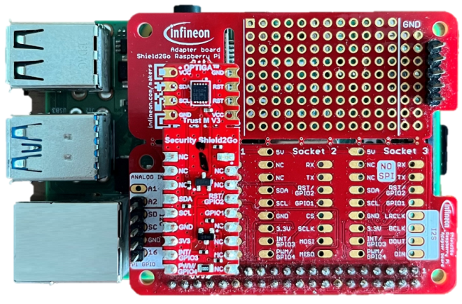

# Linux tools and examples</br> for OPTIGA™ Trust V1/V3 security solution

- [Linux tools and examples for OPTIGA™ Trust V1/V3 security solution](#linux-tools-and-examples-for-optiga-trust-m1m3-security-solution)
  - [About](#about)
    - [Prerequisites](#prerequisites)
  - [Getting Started](#getting-started)
    - [Getting the Code from Github](#getting-the-code-from-github)
    - [First time building the library](#first-time-building-the-library)
  - [CLI Tools Usage](#cli-tools-usage)
    - [Important Notes:](#important-notes)
    - [trustm\_cert](#trustm_cert)
    - [trustm\_chipinfo](#trustm_chipinfo)
    - [trustm\_data](#trustm_data)
    - [trustm\_ecc\_keygen](#trustm_ecc_keygen)
    - [trustm\_ecc\_sign](#trustm_ecc_sign)
    - [trustm\_ecc\_verify](#trustm_ecc_verify)
    - [trustm\_errorcode](#trustm_errorcode)
    - [trustm\_metadata](#trustm_metadata)
    - [trustm\_monotonic\_counter](#trustm_monotonic_counter)
    - [trustm\_read\_data](#trustm_read_data)
    - [trustm\_readmetadata\_data](#trustm_readmetadata_data)
    - [trustm\_readmetadata\_private](#trustm_readmetadata_private)
    - [trustm\_readmetadata\_status](#trustm_readmetadata_status)
    - [trustm\_read\_status](#trustm_read_status)
    - [trustm\_rsa\_dec](#trustm_rsa_dec)
    - [trustm\_rsa\_enc](#trustm_rsa_enc)
    - [trustm\_rsa\_keygen](#trustm_rsa_keygen)
    - [trustm\_rsa\_sign](#trustm_rsa_sign)
    - [trustm\_rsa\_verify](#trustm_rsa_verify)
    - [trustm\_symmetric\_keygen](#trustm_symmetric_keygen)
    - [trustm\_symmetric\_enc](#trustm_symmetric_enc)
    - [trustm\_symmetric\_dec](#trustm_symmetric_dec)
    - [trustm\_hkdf](#trustm_hkdf)
    - [trustm\_rng](#trustm_rng)
    - [trustm\_hash](#trustm_hash)
    - [trustm\_hmac](#trustm_hmac)
    - [trustm\_hmac\_verify\_Auth](#trustm_hmac_verify_auth)
    - [trustm\_protected\_update](#trustm_protected_update)
    - [trustm\_protected\_update\_aeskey](#trustm_protected_update_aeskey)
    - [trustm\_protected\_update\_ecckey](#trustm_protected_update_ecckey)
    - [trustm\_protected\_update\_rsakey](#trustm_protected_update_rsakey)
    - [trustm\_protected\_update\_data](#trustm_protected_update_data)
    - [trustm\_update\_with\_PBS\_Auto](#trustm_update_with_pbs_auto)
    - [trustm\_probe](#trustm_probe)
  - [OPTIGA™ Trust M OpenSSL Provider usage](#provider_usage)
    - [rand](#rand)
    - [req](#req)
    - [pkey](#pkey)
    - [pkeyutl](#pkeyutl)
    - [Referencing keys in OPTIGA™ Trust M](#referencing-keys-in-optiga-trust-m)
    - [Testing TLS connection with ECC key](#testing-tls-connection-with-ecc-key)
      - [Scenario where Trust M is on the client ](#scenario-where-trust-m-is-on-the-client-)
      - [Scenario where Trust M is on the server ](#scenario-where-trust-m-is-on-the-server-)
      - [Testing TLS connection with ECC Reference key in file format](#testing-tls-connection-with-ecc-reference-key-in-file-format)
      - [Testing Curl connection using ECC Reference key in file format](#testing-curl-connection-with-ecc-reference-key-in-file-format)
    - [Testing TLS connection with RSA key](#test_tls_rsa)
      - [Scenario where Trust M is on the client ](#scenario-where-trust-m-is-on-the-client--1)
      - [Scenario where Trust M is on the server ](#scenario-where-trust-m-is-on-the-server--1)
    - [Generating a Test Server Certificate](#test_server_cert)
    - [Using OPTIGA™ Trust M OpenSSL provider to sign and issue certificate](#using-optiga-trust-m-openssl-provider-to-sign-and-issue-certificate)
  - [Known observations](#known-observations)
    - [Secure communication bypass](#secure-communication-bypass)

## <a name="about"></a>About

This is a Linux Tools for OPTIGA Trust V1/V3 on Linux platform that consist of:

- [Command Line Interface examples](#cli_usage)
- [OpenSSL Provider](#provider_usage)


### <a name="prerequisites"></a>Prerequisites

Following is the software component to build the tools :
* GCC
* OpenSSL 3.x
* OPTIGA Trust V3 library (source code)
* pthread
* rt


Hardware platforms and boards:
* Raspberry PI 4  on Linux kernel >= 5.15

* Micro SD card (≥16GB)

* [S2GO SECURITY OPTIGA™ Trust M](https://www.infineon.com/cms/en/product/evaluation-boards/s2go-security-optiga-m/)  paired with [OPTIGA™ Trust M MTR SHIELD](https://www.infineon.com/cms/en/product/evaluation-boards/trust-m-mtr-shield/)

* [Shield2Go Adapter for Raspberry Pi](https://www.infineon.com/cms/en/product/evaluation-boards/s2go-adapter-rasp-pi-iot/) paired with [Pi Click Shield](https://www.mikroe.com/pi-4-click-shield) 

  
  
  Note: OPTIGA™ Trust M Provider is tested on Linux Raspberry PI 6.6.31+rpt-rpi--v8 aarch64 with OpenSSL 3.0.14 pre-installed
  
  
  
  Figure 1 Connection for S2GO SECURITY OPTIGA™ Trust M using Shield2Go Adapter
  
  
  
  Figure 2 Hardware Setup for S2GO SECURITY OPTIGA™ Trust M using Shield2Go Adapter
  
  

​       Figure 3 Hardware Setup for OPTIGA™ Trust M MTR SHIELD using Pi Click Shield

## <a name="getting_started"></a>Getting Started

### <a name="getting_code"></a>Getting the Code from GitHub

Getting the initial code from GitHub with submodules

```
git clone --recurse-submodules https://github.com/Infineon/linux-optiga-trust-m.git
```

### <a name="build_lib"></a>First time building the library
Run the commands below in sequence to install the required dependencies and the OPTIGA™ Trust M provider. 

    cd linux-optiga-trust-m
    ./trustm_installation_script.sh

Note: 

Enable I2C interface for Raspberry Pi to communicate with OPTIGA™ Trust M

## <a name="cli_usage"></a>CLI Tools Usage

### Important Notes:  
1. To pair the host with OPTIGA™ Trust M, please run the test script "write_default_shared_secret" inside "**linux-optiga-trust-m/scripts/misc/**" to write the default shared secret into OPTIGA™ Trust M.
2. For secuirty reason, all commands in the following examples are with "**Shielded Connection Enabled**" and hence will increase the security counter by one. It is at the user discretion to disable "**Shielded Connection**" by using "**-X**" option if required by the application.   

### <a name="trustm_cert"></a>trustm_cert

Read/Write/Clear certificate from/to certificate data object. Output and input certificate in PEM format.

```console
./bin/trustm_cert
Help menu: trustm_cert <option> ...<option>
option:- 
-r <Cert OID>  	: Read Certificate from OID 0xNNNN 
-w <Cert OID>  	: Write Certificte to OID
-o <filename>  	: Output certificate to file 
-i <filename>  	: Input certificate to file 
-c <Cert OID>   : Clear cert OID data to zero 
-X              : Bypass Shielded Communication 
-h              : Print this help 
```

Example : read OID 0xE0E0 and output the certification to teste0e0.crt

```console
./bin/trustm_cert -r 0xe0e0 -o teste0e0.crt
========================================================
OID              : 0xE0E0 
Output File Name : teste0e0.crt 
Success!!!
========================================================

cat teste0e0.crt 
-----BEGIN CERTIFICATE-----
MIIB2DCCAX6gAwIBAgIEERCFGjAKBggqhkjOPQQDAjByMQswCQYDVQQGEwJERTEh
MB8GA1UECgwYSW5maW5lb24gVGVjaG5vbG9naWVzIEFHMRMwEQYDVQQLDApPUFRJ
R0EoVE0pMSswKQYDVQQDDCJJbmZpbmVvbiBPUFRJR0EoVE0pIFRydXN0IE0gQ0Eg
MTAxMB4XDTE5MDYxODA2MzAxMFoXDTM5MDYxODA2MzAxMFowHDEaMBgGA1UEAwwR
SW5maW5lb24gSW9UIE5vZGUwWTATBgcqhkjOPQIBBggqhkjOPQMBBwNCAAQRjgnP
/Cuv2C6aEHEiIib60TBi8TU0GN6LXMKAShMUNd6yYosO3Cv3XExwWVqkbeAIrXRo
gM3bPK7w5CRWu8hqo1gwVjAOBgNVHQ8BAf8EBAMCAIAwDAYDVR0TAQH/BAIwADAV
BgNVHSAEDjAMMAoGCCqCFABEARQBMB8GA1UdIwQYMBaAFDwwjFzViuijXTKA5FSD
sv/Nhk0jMAoGCCqGSM49BAMCA0gAMEUCIQC5y2fv2p1VS41jSX72pl/B3am+Oboy
B1ItWszBjNzc0AIgEiPyApU78Oif0drcgQhH0qfxaKPJAFySCb2wpHYy6Uc=
-----END CERTIFICATE-----
```

Example : write certificate teste0e0.crt into OID 0xE0E1

```console
./bin/trustm_cert -w 0xe0e1 -i teste0e0.crt 
========================================================
Success!!!
========================================================
```

Example : clear certificate store in OID 0xE0E1

```console
./bin/trustm_cert -c 0xe0e1
========================================================
Cleared.
========================================================
```

### <a name="trustm_chipinfo"></a>trustm_chipinfo

Display the OPTIGA™ Trust M chip information

```console
./bin/trustm_chipinfo 
Read Chip Info [0xE0C2]: Success.
========================================================
CIM Identifier             [bCimIdentifer]: 0xcd
Platform Identifer   [bPlatformIdentifier]: 0x16
Model Identifer         [bModelIdentifier]: 0x33
ID of ROM mask                  [wROMCode]: 0x8201
Chip Type                    [rgbChipType]: 0x00 0x1c 0x00 0x05 0x00 0x00
Batch Number              [rgbBatchNumber]: 0x0a 0x09 0x1b 0x5c 0x00 0x07
X-coordinate              [wChipPositionX]: 0x0020
Y-coordinate              [wChipPositionY]: 0x008e
Firmware Identifier [dwFirmwareIdentifier]: 0x80101071
Build Number                 [rgbESWBuild]: 08 09

Chip software build: 
OPTIGA(TM) Trust M rev.1; Firmware Version: 1.30.809
========================================================
```

### <a name="trustm_data"></a>trustm_data

Read/Write/Erase OID data object in raw format.

```console
./bin/trustm_data 
Help menu: trustm_data <option> ...<option>
option:- 
-r <OID>      : Read from OID 0xNNNN 
-w <OID>      : Write to OID
-i <filename> : Input file 
-I <value>    : Input byte value 
-o <filename> : Output file 
-p <offset>   : Offset position 
-e            : Erase and write 
-X            : Bypass Shielded Communication 
-h            : Print this help  
```

Example : writing text file 1234.txt into OID 0xE0E1 and reading after writing

```console
cat 1234.txt 
1234

./bin/trustm_data -w 0xe0e1 -i 1234.txt
========================================================
Device Public Key           [0xE0E1] Offset: 0
Input data : 
	31 32 33 34 0a 
Write Success.
========================================================

./bin/trustm_data -r 0xe0e1
========================================================
Device Public Key           [0xE0E1] [Size 0005] : 
	31 32 33 34 0a 
========================================================
```

Example : erase with offset OID 0xE0E1

```console
./bin/trustm_data -w 0xe0e1 -e -p 10 -i 1234.txt
========================================================
Device Public Key           [0xE0E1] Offset: 10
Input data : 
	31 32 33 34 0a 
Write Success.
========================================================

./bin/trustm_data -r 0xe0e1
========================================================
Device Public Key           [0xE0E1] [Size 0015] : 
	00 00 00 00 00 00 00 00 00 00 31 32 33 34 0a 
========================================================
```

### <a name="trustm_ecc_keygen"></a>trustm_ecc_keygen

Generate OPTIGA™ Trust M ECC key pair. Key type can be or together to form multiple type.

```console
./bin/trustm_ecc_keygen 
Help menu: trustm_ecc_keygen <option> ...<option>
option:- 
-g <Key OID>    : Generate ECC Key in OID 0xNNNN 
-t <key type>   : Key type Auth:0x01 Enc :0x02 HFWU:0x04
                           DevM:0X08 Sign:0x10 Agmt:0x20
                           [default Auth]
-k <key size>   : Key size ECC256:0x03 ECC384:0x04 ECC521:0x05
                           BRAINPOOL256:0x13 BRAINPOOL384:0x15 BRAINPOOL512:0x16
                           [default ECC256]
-o <filename>   : Output Pubkey to file in PEM format
-s              : Save Pubkey in <Key OID + 0x10E0>
                  For ECC521/BRAINPOOL512: 
                  Save Pubkey in <Key OID + 0x10EF>
-X              : Bypass Shielded Communication 
-h              : Print this help 
```

**Note:** For ECC521/BRAINPOOL512 keygen with "**-s**", the private key slot can only be chosen from 0xE0F1 and 0xE0F2 if you want to save the public key into the data objects. User may make use of "**-o**" option to output public key to file. 

For private key slot 0xE0F1, the public key will be stored in 0xF1E0.

For private key slot 0xE0F2, the public key will be stored in 0xF1E1.

Example : generate an ECC256 key with type Auth/Enc/Sign in OID 0xE0F3 and save pubkey in OID 0xF1D3.

```console
./bin/trustm_ecc_keygen -g 0xe0f3 -t 0x13 -k 0x03 -o test_e0f3_pub.pem -s
========================================================
Generating Key to 0xE0F3
Output File Name : test_e0f3_pub.pem 
Pubkey :
	30 59 30 13 06 07 2A 86 48 CE 3D 02 01 06 08 2A 
	86 48 CE 3D 03 01 07 03 42 00 04 F1 55 65 CB 42 
	FB 3E 58 DB C6 9F 67 E8 FC D3 48 F6 AA 5F 13 2D 
	F6 3B A7 90 22 B4 B6 D3 4E 5B BB 98 AB 46 97 BD 
	2A 03 A6 27 A5 4D FB 95 C2 BB 9A D3 AF A9 4E A7 
	D6 A1 63 9F 93 B6 71 57 07 E6 00 
Write Success to OID: 0xF1D3.
========================================================

cat test_e0f3_pub.pem 
-----BEGIN PUBLIC KEY-----
MFkwEwYHKoZIzj0CAQYIKoZIzj0DAQcDQgAE8VVly0L7Pljbxp9n6PzTSPaqXxMt
9junkCK0ttNOW7uYq0aXvSoDpielTfuVwrua06+pTqfWoWOfk7ZxVwfmAA==
-----END PUBLIC KEY-----

./bin/trustm_data -r 0xf1d3
========================================================
App DataStrucObj type 3     [0xF1D3] [Size 0091] : 
	30 59 30 13 06 07 2A 86 48 CE 3D 02 01 06 08 2A 
	86 48 CE 3D 03 01 07 03 42 00 04 F1 55 65 CB 42 
	FB 3E 58 DB C6 9F 67 E8 FC D3 48 F6 AA 5F 13 2D 
	F6 3B A7 90 22 B4 B6 D3 4E 5B BB 98 AB 46 97 BD 
	2A 03 A6 27 A5 4D FB 95 C2 BB 9A D3 AF A9 4E A7 
	D6 A1 63 9F 93 B6 71 57 07 E6 00 
========================================================
```

### <a name="trustm_ecc_sign"></a>trustm_ecc_sign

Simple demo to show the process to sign using OPTIGA™ Trust M ECC key.

*Note : to output OpenSSL signature format used -o*

```console
./bin/trustm_ecc_sign 
Help menu: trustm_ecc_sign <option> ...<option>
option:- 
-k <OID Key>  : Select ECC key for signing OID (0xE0F0-0xE0F3) 
-o <filename> : Output to file with header
-O <filename> : Output to file without header
-i <filename> : Input Data file
-H            : Hash before sign
-X            : Bypass Shielded Communication 
-h            : Print this help 
```

Example : Hash and sign the file helloworld.txt with key OID 0xE0F3 and output to testsignature.bin

```console
./bin/trustm_ecc_sign -k 0xe0f3 -o testsignature.bin -i helloworld.txt -H
========================================================
OID Key          : 0xE0F3
Output File Name : testsignature.bin 
Input File Name  : helloworld.txt 
Hash Success : SHA256
	8C D0 7F 3A 5F F9 8F 2A 78 CF C3 66 C1 3F B1 23 
	EB 8D 29 C1 CA 37 C7 9D F1 90 42 5D 5B 9E 42 4D 
	
filesize: 11
Success
========================================================

hd testsignature.bin 
00000000  30 44 02 20 14 ea 77 98  ed 26 89 40 22 bb a0 60  |0D. ..w..&.@"..`|
00000010  c5 1f 01 8f 65 21 7a 98  0d 63 73 03 4e ea 13 39  |....e!z..cs.N..9|
00000020  0c ed 58 8a 02 20 2a 7b  fc 7a dd 2e 75 86 41 f5  |..X.. *{.z..u.A.|
00000030  43 14 ec e8 14 34 6b 2a  20 68 23 eb 14 ec 59 2f  |C....4k* h#...Y/|
00000040  37 04 37 44 62 c9                                 |7.7Db.|
00000046
```

### <a name="trustm_ecc_verify"></a>trustm_ecc_verify

Simple demo to show the process to verify using OPTIGA™ Trust M library.

```console
./bin/trustm_ecc_verify 
Help menu: trustm_ecc_verify <option> ...<option>
option:- 
-k <OID Key>   : Use Certificate from OID [0xE0E1-E0E3]
-p <pubkey>    : Use Pubkey file
-i <filename>  : Input Data file
-s <signature> : Signature file
-H             : Hash input before verify
-X             : Bypass Shielded Communication 
-h             : Print this help
```

Example : verifying a signature using external public key.

```console
./bin/trustm_ecc_verify -i helloworld.txt -s testsignature.bin -p test_e0f3_pub.pem -H
========================================================
Pubkey file         : test_e0f3_pub.pem
Input File Name     : helloworld.txt 
Signature File Name : testsignature.bin 
Hash Digest : 
	8C D0 7F 3A 5F F9 8F 2A 78 CF C3 66 C1 3F B1 23 
	EB 8D 29 C1 CA 37 C7 9D F1 90 42 5D 5B 9E 42 4D 
	
Signature : 
	02 20 14 EA 77 98 ED 26 89 40 22 BB A0 60 C5 1F 
	01 8F 65 21 7A 98 0D 63 73 03 4E EA 13 39 0C ED 
	58 8A 02 20 2A 7B FC 7A DD 2E 75 86 41 F5 43 14 
	EC E8 14 34 6B 2A 20 68 23 EB 14 EC 59 2F 37 04 
	37 44 62 C9 
Pub key : [256]
	03 42 00 04 F1 55 65 CB 42 FB 3E 58 DB C6 9F 67 
	E8 FC D3 48 F6 AA 5F 13 2D F6 3B A7 90 22 B4 B6 
	D3 4E 5B BB 98 AB 46 97 BD 2A 03 A6 27 A5 4D FB 
	95 C2 BB 9A D3 AF A9 4E A7 D6 A1 63 9F 93 B6 71 
	57 07 E6 00 
Verify Success.
========================================================
```

Example : verifying using certificate store in OID 0xE0E3.

*Note :  This example assume you have a valid x.509 certificate with key usage for signature store in OID 0xE0E3 and data is signed by the private key of the x.509 certificate.*  

```console
./bin/trustm_ecc_verify -i helloworld.txt -s testsignature.bin -k 0xe0e3 -H
========================================================
OID Cert            : 0xE0E3
Input File Name     : helloworld.txt 
Signature File Name : testsignature.bin 
Hash Digest : 
	8C D0 7F 3A 5F F9 8F 2A 78 CF C3 66 C1 3F B1 23 
	EB 8D 29 C1 CA 37 C7 9D F1 90 42 5D 5B 9E 42 4D 
	
Signature : 
	02 20 14 EA 77 98 ED 26 89 40 22 BB A0 60 C5 1F 
	01 8F 65 21 7A 98 0D 63 73 03 4E EA 13 39 0C ED 
	58 8A 02 20 2A 7B FC 7A DD 2E 75 86 41 F5 43 14 
	EC E8 14 34 6B 2A 20 68 23 EB 14 EC 59 2F 37 04 
	37 44 62 C9 
Verify Success.

========================================================
```

### <a name="trustm_errorcode"></a>trustm_errorcode

List all the known OPTIGA™ Trust M error code with description

### <a name="trustm_metadata"></a>trustm_metadata

Modify OPTIGA™ Trust M OID metadata.

***Warning : Any manipuldation with the lifecycle state LcsO like -I, -O and -T option might lock the data/key slot permanently. Depending on the access condition cofiguration "locking"  means you would be able to use it, but, for instance, not change.**.* 

The Lcs is implemented in a way that the four primary states only progress in one direction from a lower value to a higher value(e.g. initialization(in)=>operational(op) state). Once Lcs0 is set to higher value, it is not reversible and can not be set to lower value any more.

```console
./bin/trustm_metadata 
Help menu: trustm_metadata <option> ...<option>
option:- 
-r <OID>  : Read metadata of OID 0xNNNN 
-w <OID>  : Write metadata of OID
-C <data> : Set Change mode (a:ALW,
                             n:NEV,
                             i:Lsc0 < 0x03,
                             o:Lsc0 < 0x07,
                             t:Lsc0 < 0x0F,
                             f:<input file for complex setting>)
-R <data> : Set Read mode   (a:ALW,
                             n:NEV,
                             i:Lsc0 < 0x03,
                             o:Lsc0 < 0x07,
                             t:Lsc0 < 0x0F,
                             f:<input file for complex setting>)
-E <data> : Set Change mode (a:ALW,
                             n:NEV,
                             i:Lsc0 < 0x03,
                             o:Lsc0 < 0x07,
                             t:Lsc0 < 0x0F,
                             f:<input file for complex setting>)
-F <file> : Custom input
          : (Need to input the full Metadata to be written)
-I        : Set Initialization State (Lsc0: 0x03)
-O        : Set Operational State (Lsc0: 0x07)
-T        : Set Termination State (Lsc0: 0x0F)
-X        : Bypass Shielded Communication 
-h        : Print this help 
```

Example : changing OID 0xE0E1 metadata to read only and reading the metadata after changing

```console
./bin/trustm_metadata -w 0xe0e1 -Cn -Ra
========================================================
Device Public Key           [0xE0E1] 
	20 06 D0 01 FF D1 01 00 
	C:NEV, R:ALW, 
Write Success.
========================================================

./bin/trustm_metadata -r 0xe0e1
========================================================
Device Public Key           [0xE0E1] [Size 0025] : 
	20 17 c0 01 01 c4 02 06 c0 c5 02 01 dc d0 01 ff 
	d1 01 00 d3 01 00 e8 01 12 
	LcsO:0x01, Max:1728, Used:476, C:NEV, R:ALW, E:ALW, DType:DEVCERT, 

========================================================
```

Example : charging OID 0xE0E1 metadata using complex setting (LcsO>3||LcsG<4) for Change mode

```console
echo -e -n \\x07\\xe1\\xfb\\x03\\xfe\\x70\\xfc\\x04 > complexsetting.bin

hd complexsetting.bin 
00000000  07 e1 fb 03 fe 70 fc 04                           |.....p..|
00000008

./bin/trustm_metadata -w 0xe0e1 -Cf:complexsetting.bin 
========================================================
Device Public Key           [0xE0E1] 
	20 09 D0 07 E1 FB 03 FE 70 FC 04 
	C:LcsO>3||LcsG<4, 
Write Success.
========================================================

./bin/trustm_metadata -r 0xe0e1
========================================================
Device Public Key           [0xE0E1] [Size 0031] : 
	20 1d c0 01 01 c4 02 06 c0 c5 02 01 dc d0 07 e1 
	fb 03 fe 70 fc 04 d1 01 00 d3 01 00 e8 01 12 
	LcsO:0x01, Max:1728, Used:476, C:LcsO>3||LcsG<4, R:ALW, E:ALW, DType:DEVCERT, 

========================================================
```

### <a name="trustm_monotonic_counter"></a>trustm_monotonic_counter

Simple demo to show the OPTIGA™ Trust M monotonic counter.

```console
./bin/trustm_monotonic_counter 
Help menu: trustm_monotonic_counter <option> ...<option>
option:- 
-r <OID>      : Read from OID [0xE120-0xE123] 
-w <OID>      : Write to OID [0xE120-0xE123] 
-u <OID>      : Update Counter [0xE120-0xE123] 
-i <value>    : Input Value 
-s <value>    : Increment Steps 
-X            : Bypass Shielded Communication 
-h            : Print this help
```

Example : Setting the threshold value to 10 and resetting the counter to zero

```console
./bin/trustm_monotonic_counter -w 0xe120 -i 10
========================================================
Input Value : 10 [0x0000000A]
	00 00 00 00 00 00 00 0a 
Write Success.
========================================================
```

Example : Count up the monotonic counter in steps of 2

```console
./bin/trustm_monotonic_counter -u 0xe120 -s 2
========================================================
Steps Value : 2 [0x00000002]
Update Counter Success.
========================================================

./bin/trustm_monotonic_counter -r 0xe120
========================================================
Monotonic Counter x : [0xE120]
Threshold           : 0x0000000A [10]
Counter Value       : 0x00000002 [2]
========================================================
```

### <a name="trustm_read_data"></a>trustm_read_data

Read all data object listed below

*oid : 0xE0E0-0xE0E3, 0xE0E8-0xE0E9, 0xE0EF,* 

​         *0xE120-0xE123,* 

​         *0xE140, 0xF1D0-0xF1DB, 0xF1E0-0xF1E1*

### <a name="trustm_readmetadata_data"></a>trustm_readmetadata_data

Read all data object metadata listed below 

*oid : 0xE0E0-0xE0E3, 0xE0E8-0xE0E9, 0xE0EF,* 

​         *0xE120-0xE123,* *0xE200*,

​         *0xE140, 0xF1D0-0xF1DB, 0xF1E0-0xF1E1*

### <a name="trustm_readmetadata_private"></a>trustm_readmetadata_private

Read all data object metadata listed below 

*oid : 0xE0F0-0xE0F3,* 

​         *0xE0FC-0xE0FD*

### <a name="trustm_readmetadata_status"></a>trustm_readmetadata_status

Read all data object metadata listed below 

*oid : 0xE0C0-0xE0C6,* 

​         *0xF1C0-0xF1C2*

### <a name="trustm_read_status"></a>trustm_read_status

Read all data object listed below 

*oid : 0xE0C0-0xE0C6,* 

​        *0xF1C0-0xF1C2*

### <a name="trustm_rsa_dec"></a>trustm_rsa_dec

Simple demo to show the process to decrypt using OPTIGA™ Trust M RSA key.

*Note : This example assume RSA key with usage Encryption has already been generated and data is encrypted by the pubkey*

```console
./bin/trustm_rsa_dec
Help menu: trustm_rsa_dec <option> ...<option>
option:- 
-k <OID Key>  : Select key to decrypt OID 0xNNNN 
-o <filename> : Output to file 
-i <filename> : Input Data file
-X            : Bypass Shielded Communication 
-h            : Print this help 
```

 Example : Decrypt using OID Key 0xE0FC, an encrypted file test_e0fc.enc and output to test_e0fc.dec

```console
./bin/trustm_rsa_dec -k 0xe0fc -o test_e0fc.dec -i test_e0fc.enc 
========================================================
OID Key          : 0xE0FC 
Output File Name : test_e0fc.dec 
Input File Name  : test_e0fc.enc 
Input data : 
	35 38 AC E8 54 CA 02 92 A7 B4 72 0A 62 F9 7B DD 
	CC C7 E1 9C A4 52 D6 AF CC 04 E4 B4 54 19 85 DD 
	10 80 FA 8B 04 8E B0 5E 29 C5 F5 2F A7 99 BB EC 
	2E 69 D4 AB 35 80 BF F5 87 6D 80 65 60 3E A6 31 
	6E 05 80 F2 CB 9E 32 DA F2 82 DB 15 D6 9C 1E DF 
	FE 1C 5E 1F 7F E6 6D 2A EA B3 54 AD 41 AF C2 08 
	FE BF C7 B5 87 22 79 A2 AA F3 0D 71 BA DB 5D F7 
	CE 50 EA 89 D4 42 BD 0B 11 6A C8 11 2F 09 99 28 
	
Success
========================================================

cat test_e0fc.dec 
helloworld!!!
```

### <a name="trustm_rsa_enc"></a>trustm_rsa_enc

Simple demo to show the process to encrypt using OPTIGA™ Trust M RSA key.

```console
./bin/trustm_rsa_enc 
Help menu: trustm_rsa_enc <option> ...<option>
option:- 
-k <OID Key>  : Select key for encrypt OID 0xNNNN 
-p <pubkey>   : Use Pubkey file
-o <filename> : Output to file 
-i <filename> : Input Data file
-X            : Bypass Shielded Communication 
-h            : Print this help
```

Example : Encrypt using external pubkey

```console
./bin/trustm_rsa_enc -p test_e0fc_pub.pem -o test_e0fc.enc -i helloworld.txt 
========================================================
Pubkey file      : test_e0fc_pub.pem 
Output File Name : test_e0fc.enc 
Input File Name  : helloworld.txt 
Input data : 
	68 65 6C 6C 6F 77 6F 72 6C 64 21 21 21 0A 
Success
========================================================
```

Example : Encrypt using Certificate store in OID 0xE0E2

*Note :  This example assume you have a valid x.509 certificate with key usage for Key Encipherment store in OID 0xE0E2.*  

```console
./bin/trustm_rsa_enc -k 0xe0e2 -o test_e0fc1.enc -i helloworld.txt 
========================================================
OID Key          : 0xE0E2 
Output File Name : test_e0fc1.enc 
Input File Name  : helloworld.txt 
Input data : 
	68 65 6C 6C 6F 77 6F 72 6C 64 21 21 21 0A 
Success
========================================================
```

### <a name="trustm_rsa_keygen"></a>trustm_rsa_keygen

Generate OPTIGA™ Trust M RSA key pair. Key type can be or together to form multiple type.

```console
./bin/trustm_rsa_keygen 
Help menu: trustm_rsa_keygen <option> ...<option>
option:- 
-g <Key OID>    : Generate RSA Key in OID [0xE0FC-0xE0FD] 
-t <key type>   : Key type Auth:0x01 Enc :0x02 HFWU:0x04
                  DevM:0X08 Sign:0x10 Agmt:0x20
                  [default Auth]
-k <key size>   : Key size RSA1024:0x41 RSA2048:0x42 [default RSA1024]
-o <filename>   : Output Pubkey to file in PEM format
-s              : Save Pubkey with header in <Key OID + 0x10E4>
-X              : Bypass Shielded Communication 
-h              : Print this help 
```

Example : generate an RSA1024 key with type Auth/Enc/Sign in OID 0xe0fc and save pubkey in OID 0xF1E0.

```console
./bin/trustm_rsa_keygen -g 0xe0fc -t 0x13 -k 0x41 -o test_e0fc_pub.pem -s
========================================================
Generating Key to 0xE0FC
Output File Name : test_e0fc_pub.pem 
Pubkey :
	30 81 9f 30 0d 06 09 2a 86 48 86 f7 0d 01 01 01 
	05 00 03 81 8d 00 30 81 89 02 81 81 00 9c 2d 6b 
	19 9c 8e d9 6c 59 0b bc 53 4a 1f 51 0c 87 14 71 
	09 21 55 d6 0c 1c 36 71 42 d9 dd db a2 f5 d8 de 
	df 80 d2 0f aa ae 31 6e 08 04 60 2d 32 ac 3c b7 
	e1 d0 d9 47 16 77 d7 ed d9 d3 e8 41 ed 6a e7 88 
	10 a6 2e 51 d2 cb d2 7d 9a 3b c8 09 c9 05 27 0d 
	85 39 c2 b6 4f 76 08 59 6e e7 51 07 9e 76 60 96 
	8d 63 ce 19 fc d0 a2 7c 28 c2 35 30 72 96 7d 3f 
	3c 48 95 bc 0a a5 5a 37 c6 64 e3 8e 31 02 03 01 
	00 01 
Write Success to OID: 0xF1E0.
========================================================

cat test_e0fc_pub.pem 
-----BEGIN PUBLIC KEY-----
MIGfMA0GCSqGSIb3DQEBAQUAA4GNADCBiQKBgQCcLWsZnI7ZbFkLvFNKH1EMhxRx
CSFV1gwcNnFC2d3bovXY3t+A0g+qrjFuCARgLTKsPLfh0NlHFnfX7dnT6EHtaueI
EKYuUdLL0n2aO8gJyQUnDYU5wrZPdghZbudRB552YJaNY84Z/NCifCjCNTByln0/
PEiVvAqlWjfGZOOOMQIDAQAB
-----END PUBLIC KEY-----

./bin/trustm_data -r 0xf1e0
========================================================
App DataStrucObj type 2     [0xF1E0] [Size 1500] : 
	03 81 8d 00 30 81 89 02 81 81 00 9c 2d 6b 19 9c 
	8e d9 6c 59 0b bc 53 4a 1f 51 0c 87 14 71 09 21 
	55 d6 0c 1c 36 71 42 d9 dd db a2 f5 d8 de df 80 
	d2 0f aa ae 31 6e 08 04 60 2d 32 ac 3c b7 e1 d0 
	d9 47 16 77 d7 ed d9 d3 e8 41 ed 6a e7 88 10 a6 
	2e 51 d2 cb d2 7d 9a 3b c8 09 c9 05 27 0d 85 39 
	c2 b6 4f 76 08 59 6e e7 51 07 9e 76 60 96 8d 63 
	ce 19 fc d0 a2 7c 28 c2 35 30 72 96 7d 3f 3c 48 
	95 bc 0a a5 5a 37 c6 64 e3 8e 31 02 03 01 00 01 
	47 1b 75 53 fd 53 88 72 5e 0b 83 04 29 4e 44 03 
	51 7a 50 ea f6 a7 a9 82 04 6e cb 1a fa 57 7e 17 
	b6 39 d8 76 e7 fe 76 84 59 bc e6 91 a3 f7 fc 75 
	e2 e3 f7 ec 2a d6 3e 36 c6 f0 7f fb a8 50 d5 a7 
	fc 7e c2 28 2e bf ea e2 8d c9 c9 6e 76 69 a3 a2 
	ec 2f 01 40 8f 65 ba 16 19 81 00 8f 74 17 31 da 
	0e 2f f4 19 a9 f3 00 15 8a 28 5e af 99 4e ab 96 
	7f c8 7f fd f6 ea 17 30 7f 71 8e 1f 27 a1 02 03 
	01 00 01 00 00 00 00 00 00 00 00 00 00 00 00 00 
	...
	(trucated for better view)
========================================================

```

### <a name="trustm_rsa_sign"></a>trustm_rsa_sign

Simple demo to show the process to sign using OPTIGA™ Trust M RSA key.

```console
./bin/trustm_rsa_sign 
Help menu: trustm_rsa_sign <option> ...<option>
option:- 
-k <OID Key>  : Select RSA key for signing OID (0xE0FC-0xE0FD) 
-o <filename> : Output to file 
-i <filename> : Input Data file
-H            : Hash before sign
-X            : Bypass Shielded Communication 
-h            : Print this help
```

Example : Hash and sign the file helloworld.txt with key OID 0xE0FC and output to testsignature.bin

```console
./bin/trustm_rsa_sign -k 0xe0fc -o testsignature.bin -i helloworld.txt -H
========================================================
OID Key          : 0xE0FC
Output File Name : testsignature.bin 
Input File Name  : helloworld.txt 
Hash Success : SHA256
	E0 EE B7 C6 63 CC 5F 6F 45 26 13 E2 D7 AE FF 45 
	2A 26 95 A0 2F B4 AF 30 33 CC 5B C0 62 01 DE 70 
	
filesize: 14
Success
========================================================

hd testsignature.bin
00000000  0f 20 5a d3 0f 8c ec 41  24 74 d9 e3 20 bf ba 75  |. Z....A$t.. ..u|
00000010  56 df a4 5b be 25 0e 0e  e5 32 1a f5 bf 24 45 e0  |V..[.%...2...$E.|
00000020  1d 4c f5 b7 99 0c 17 c2  49 88 52 e1 b8 b4 9e 7d  |.L......I.R....}|
00000030  da 48 6d 98 53 45 e0 12  e8 48 59 dc 80 35 cd 2f  |.Hm.SE...HY..5./|
00000040  e0 01 c1 e2 1e 1d 00 05  9a 32 3b 56 d7 90 72 a9  |.........2;V..r.|
00000050  30 06 72 c9 f4 19 62 eb  20 76 9f c8 12 cb 23 ff  |0.r...b. v....#.|
00000060  bf b1 56 80 89 ea fe 7b  52 5d f0 26 98 10 3e 82  |..V....{R].&..>.|
00000070  bf 8d a7 9b 5e 2b e9 ec  89 6f 46 f2 ee fa 03 83  |....^+...oF.....|
00000080
```

### <a name="trustm_rsa_verify"></a>trustm_rsa_verify

Simple demo to show the process to verify using OPTIGA™ Trust M library.

```console
./bin/trustm_rsa_verify 
Help menu: trustm_rsa_verify <option> ...<option>
option:- 
-k <OID Key>   : Use Certificate from Data OID 
-p <pubkey>    : Use Pubkey file
-i <filename>  : Input Data file
-s <signature> : Signature file
-H             : Hash input before verify
-X             : Bypass Shielded Communication 
-h             : Print this help
```

Example : verifying a signature using external public key.

```console
./bin/trustm_rsa_verify -i helloworld.txt -s testsignature.bin -p test_e0fc_pub.pem -H
========================================================
Pubkey file         : test_e0fc_pub.pem
Input File Name     : helloworld.txt 
Signature File Name : testsignature.bin 
Hash Digest : 
	E0 EE B7 C6 63 CC 5F 6F 45 26 13 E2 D7 AE FF 45 
	2A 26 95 A0 2F B4 AF 30 33 CC 5B C0 62 01 DE 70 
	
Signature : 
	0F 20 5A D3 0F 8C EC 41 24 74 D9 E3 20 BF BA 75 
	56 DF A4 5B BE 25 0E 0E E5 32 1A F5 BF 24 45 E0 
	1D 4C F5 B7 99 0C 17 C2 49 88 52 E1 B8 B4 9E 7D 
	DA 48 6D 98 53 45 E0 12 E8 48 59 DC 80 35 CD 2F 
	E0 01 C1 E2 1E 1D 00 05 9A 32 3B 56 D7 90 72 A9 
	30 06 72 C9 F4 19 62 EB 20 76 9F C8 12 CB 23 FF 
	BF B1 56 80 89 EA FE 7B 52 5D F0 26 98 10 3E 82 
	BF 8D A7 9B 5E 2B E9 EC 89 6F 46 F2 EE FA 03 83 
	
Pub key : [1024]
	03 81 8D 00 30 81 89 02 81 81 00 9C 2D 6B 19 9C 
	8E D9 6C 59 0B BC 53 4A 1F 51 0C 87 14 71 09 21 
	55 D6 0C 1C 36 71 42 D9 DD DB A2 F5 D8 DE DF 80 
	D2 0F AA AE 31 6E 08 04 60 2D 32 AC 3C B7 E1 D0 
	D9 47 16 77 D7 ED D9 D3 E8 41 ED 6A E7 88 10 A6 
	2E 51 D2 CB D2 7D 9A 3B C8 09 C9 05 27 0D 85 39 
	C2 B6 4F 76 08 59 6E E7 51 07 9E 76 60 96 8D 63 
	CE 19 FC D0 A2 7C 28 C2 35 30 72 96 7D 3F 3C 48 
	95 BC 0A A5 5A 37 C6 64 E3 8E 31 02 03 01 00 01 
	
Verify Success.
========================================================
```

Example : verifying using certificate store in OID 0xE0E2.

*Note :  This example assume you have a valid x.509 certificate with key usage for signature store in OID 0xE0E2 and data is signed by the private key of the x.509 certificate.*  

```console
./bin/trustm_rsa_verify -i helloworld.txt -s testsignature.bin -k 0xe0e2 -H
========================================================
OID Cert            : 0xE0E2
Input File Name     : helloworld.txt 
Signature File Name : testsignature.bin 
Hash Digest : 
	E0 EE B7 C6 63 CC 5F 6F 45 26 13 E2 D7 AE FF 45 
	2A 26 95 A0 2F B4 AF 30 33 CC 5B C0 62 01 DE 70 
	
Signature : 
	0F 20 5A D3 0F 8C EC 41 24 74 D9 E3 20 BF BA 75 
	56 DF A4 5B BE 25 0E 0E E5 32 1A F5 BF 24 45 E0 
	1D 4C F5 B7 99 0C 17 C2 49 88 52 E1 B8 B4 9E 7D 
	DA 48 6D 98 53 45 E0 12 E8 48 59 DC 80 35 CD 2F 
	E0 01 C1 E2 1E 1D 00 05 9A 32 3B 56 D7 90 72 A9 
	30 06 72 C9 F4 19 62 EB 20 76 9F C8 12 CB 23 FF 
	BF B1 56 80 89 EA FE 7B 52 5D F0 26 98 10 3E 82 
	BF 8D A7 9B 5E 2B E9 EC 89 6F 46 F2 EE FA 03 83 
	
Verify Success.

========================================================
```

###  <a name="trustm_symmetric_keygen"></a>trustm_symmetric_keygen

Simple demo to show the process to generate symmetric key using OPTIGA™ Trust M library.

Note: The Access Condition CHA for OID 0xe200 must be set to "ALW"(Only executable when LcsO<op). Fore details, please refer to the test script AES_CBC.sh inside  "**linux-optiga-trust-m/scripts/misc/**"

```console
./bin/trustm_symmetric_keygen 
Help menu: trustm_symmetric_keygen <option> ...<option>
option:- 
-t <key type>   : Key type Auth:0x01 Enc :0x02 HFWU:0x04
                           DevM:0X08 Sign:0x10 Agmt:0x20
                           [default Enc]
-k <key size>   : Key size AES128:0x81 AES192:0x82 AES256:0x83
                           [default AES128]
-X              : Bypass Shielded Communication 
-h              : Print this help 
```

Example : generate an AES256 key with type Enc in OID 0xe200.

```console
./bin/trustm_symmetric_keygen -t 0x02 -k 0x83 
========================================================
Successfully Generated Symmetric Key in 0xE200 
========================================================
```

###  <a name="trustm_symmetric_enc"></a>trustm_symmetric_enc

Simple demo to show the process to encrypt using OPTIGA™ Trust M library.

```console
./bin/trustm_symmetric_enc 
Help menu: trustm_symmetric_enc <option> ...<option>
option:- 
-m <mode>     : Mode CBC:0x09 CBC_MAC:0X0A CMAC:0X0B 
                     [default CBC]
-o <filename> : Output to file 
-i <filename> : Input Data file
-v <filename> : Input IV Value
                Only needed for CBC mode
-X            : Bypass Shielded Communication 
-h            : Print this help 

```

Example : Encrypt mydata.txt using AES256 CBC mode.

Note: Initialized value is only applicable for AES CBC mode.

```console
./bin/trustm_symmetric_enc -m 0x09 -v iv_aes256.bin -i mydata.txt -o aes256.enc 
========================================================
mode             : 0x0009 
Output File Name : aes256.enc 
Input File Name  : mydata.txt 
Input data :    
	6D 79 64 61 74 61 31 32 33 34 35 36 37 38 39 0A 
	
IV File Name  : iv_aes256.bin 
Initialized value : 
	69 6E 69 74 69 61 6C 69 7A 65 64 76 32 35 36 0A 
	
Success
========================================================
```

###  <a name="trustm_symmetric_dec"></a>trustm_symmetric_dec

Simple demo to show the process to decrypt using OPTIGA™ Trust M library.

```console
./bin/trustm_symmetric_dec -h
Help menu: trustm_symmetric_dec <option> ...<option>
option:- 
-m <mode>     : Mode CBC:0x09 
                [only support CBC mode]
-o <filename> : Output to file 
-i <filename> : Input Data file
-v <filename> : Input IV Value
-X            : Bypass Shielded Communication 
-h            : Print this help 
```

Example : decrypt aes256.enc using AES256 CBC mode.

Note: Initialized value is only applicable for AES CBC mode.

```console
./bin/trustm_symmetric_dec -m 0x09 -v iv_aes256.bin -i aes256.enc -o mydata.txt.dec
========================================================
mode             : 0x0009 
Output File Name : mydata.txt.dec 
Input File Name  : aes256.enc 
Input data : 
	E5 4E C6 9E 33 51 0F 3D 81 8C 0D 58 34 04 49 D6 
	
IV File Name  : iv_aes256.bin 
Initialized value : 
	69 6E 69 74 69 61 6C 69 7A 65 64 76 32 35 36 0A 
	
Success
========================================================
```

###  <a name="trustm_hkdf"></a>trustm_hkdf

Simple demo to show the process to derive key using OPTIGA™ Trust M library.

Note: For detailed use case, please refer to the test script hkdf.sh inside  "**linux-optiga-trust-m/scripts/misc/**"

```console
./bin/trustm_hkdf
Help menu: trustm_hkdf <option> ...<option>
option:- 
-i <OID>      : Input secret OID 0xNNNN 
                [default 0xF1D0]
-H <SHA>      : SHA256:0x08 SHA384 :0x09 SHA512:0x0A
                [default SHA256]
-f <filename> : Import Info 
-s <filename> : Import Salt 
-o <filename> : Export Derived Key 
-X            : Bypass Shielded Communication 
-h            : Print this help 
```

Example : derive key using HKDF SHA256 with shared secret in 0xF1D0.

Precondition: Write shared secret into the data object and change the metadata of this data object to PRESSEC.

```console
./bin/trustm_hkdf -i 0xF1D0 -H 0X08 -f info.bin -s salt.bin -o hkdf_f1d0_256.txt
========================================================
Run HKDF SHA256 command to derive the key

Input Secret OID: 0xF1D0
HKDF Type 0x0008
Output Derived key. 
========================================================
HKDF Type        : 0x0008 
Info File Name   : info.bin 
Salt File Name   : salt.bin 
Output File Name : hkdf_f1d0_256.txt 
salt data : 
	73 61 6C 74 31 32 33 34 35 36 37 38 39 61 62 31 
	32 33 34 35 36 37 38 39 0A 
Info data : 
	69 6E 66 6F 76 61 6C 75 65 31 32 33 0A 
Success
Decryption Key :
	D6 8B 57 18 C3 E8 F7 82 5F 1C A5 19 A7 59 26 8B 
	
========================================================
```

###  <a name="trustm_rng"></a>trustm_rng

Random number generator using OPTIGA™ Trust M.

```console
./bin/trustm_rng -h

Help menu: trustm_rng <option> ...<option>
option:- 
-t <rng type>   : TRNG:0x00 DRNG:0x01
                  [default TRNG]
-l <rng length> : rng length 
                  [default 64]
-o <filename>   : Output RNG to file
-X              : Bypass Shielded Communication 
-h              : Print this help 
```

Example : To Generate 64 bytes RNG using TRNG type.

```console
./bin/trustm_rng -t 0x00 -l 64 -o rng.txt 

========================================================
Output File Name : rng.txt 
Generating RNG Number ........
OPTIGA execution time: 0.1205 sec.
RNG Number :
	27 7D B5 AD 55 53 CF 5C F5 D2 95 44 80 0D 36 39 
	7A 3E 2F F4 49 2F 0A 32 92 C3 2B 2C 92 7F F4 72 
	AF 50 7D D3 6E E9 B5 B2 F1 40 6B FF 4F DA 17 9D 
	C7 B9 C6 F6 0A FD 99 61 D9 57 5F F1 CD 23 3D 46 
	
Success
========================================================
```

###  <a name="trustm_hash"></a>trustm_hash

Hash input file using OPTIGA™ Trust M SHA256 function .

```console
./bin/trustm_hash -h

Help menu: trustm_hash <option> ...<option>
option:- 
-o <filename> : Output to file 
-i <filename> : Input Data file
-H            : Hash with SHA256
-X            : Bypass Shielded Communication 
-h            : Print this help 

```

Example : To hash input file datain.txt using OPTIGA™ Trust M SHA256 function.

```console
./bin/trustm_hash -i datain.txt -o hash_sha256.bin -H -X

Bypass Shielded Communication. 
========================================================
Output File Name : hash_sha256.bin 
Input File Name  : datain.txt 
OPTIGA execution time: 0.4596 sec.
filesize: 2500
Hash Success
========================================================
```

###  <a name="trustm_hmac"></a>trustm_hmac

Simple demo to show the process to generate the MAC for the given input data using the secret installed in OPTIGA™ Trust M.

Note: For detailed use case, please refer to the test script hmac.sh inside  "**linux-optiga-trust-m/scripts/misc/**"

```console
./bin/trustm_hmac
Help menu: trustm_hmac <option> ...<option>
option:- 
-I <OID>      : Input secret OID 0xNNNN 
                [default 0xF1D0]
-H <SHA>      : hmac_SHA256:0x20 hmac_SHA384 :0x21 hmac_SHA512:0x22
                [default hmac_SHA256]
-o <filename> : Output MAC Data 
-i <filename> : Input Data file
-X            : Bypass Shielded Communication 
-h            : Print this help  
```

Example : generate MAC value using HMAC SHA256 with shared secret in 0xF1D0.

Precondition: Write shared secret into the data object and change the metadata of this data object to PRESSEC.

```console
./bin/trustm_hmac -I 0xF1D0 -H 0X20 -i hmac.txt -o hmac_data.txt
========================================================
Input Secret OID: 0xF1D0
SHA Type 0x0020
output the MAC data. 
========================================================
HMAC Type         : 0x0020 
Output File Name : hmac_data.txt 
Input File Name  : hmac.txt 
Input data : 
	68 6D 61 63 74 65 73 74 31 32 33 34 35 36 37 38 
	0A 
MAC data :
	1A 36 BA 85 4F B1 CC A5 4C 83 98 CD 5B CB EB 67 
	7D D5 07 B6 BD 9A E0 73 15 0D F6 63 6B 57 E1 6F 
	
========================================================

```

###  <a name="trustm_hmac_verify_Auth"></a>trustm_hmac_verify_Auth

Simple demo to show the process to do hmac verification with authorization reference(the secret installed in OPTIGA™ Trust M).

```console
./bin/trustm_hmac_verify_Auth -h
Help menu: trustm_hmac_verify_Auth <option> ...<option>
option:- 
-I <OID>      : Input secret OID 0xNNNN 
                [default 0xF1D0]
-s <filename> : Input user secret 
-r <OID>      : Read from target OID
-w <OID>      : Write into target OID 0xNNNN 
-o <filename> : Output Data stored inside target OID
-X            : Bypass Shielded Communication 
-h            : Print this help 
```

Precondition: Write shared secret into the data object and change the metadata of this data object to AUTHREF.

Note: For detailed use case, please refer to the sample test scripts inside  "**linux-optiga-trust-m/scripts/hmac_secure_storage/**"

Run hmac_authenticated_storage_provisioning_step1.sh to do the provision for secret OID and Target OID.

Run hmac_authenticated_read_write_step2.sh to write in or readout the data in target OID after hmac verify successfully.

###  <a name="trustm_protected_update"></a>trustm_protected_update

Simple demo to show the process to do protected update for metadata of target OID by using the trust Anchor installed in OPTIGA™ Trust M and/or the secret installed in OPTIGA™ Trust M .

```console
./bin/trustm_protected_update -h
Help menu: trustm_protected_update <option> ...<option>
option:- 
-k <OID>       : Target OID 
-f <filename>  : Fragment file
-m <filename>  : Manifest file
-X             : Bypass Shielded Communication 
-h             : Print this help 
```

For detailed example for Integrity and Confidentiality Protected Update, Go to the subsection at [Integrity and Confidentiality Protected Update example](./scripts/protected_update_metadata/)

*Note :*  
*To generate the manifest and fragment for Integrity and Confidentiality Protected Update, please refer to the [README.md](./ex_protected_update_data_set) for more instruction*

###  <a name="trustm_protected_update_aeskey"></a>trustm_protected_update_aeskey

Simple demo to show the process to do protected update for AES key of target OID(0xE200) by using the trust Anchor installed in OPTIGA™ Trust M and/or the secret installed in OPTIGA™ Trust M .

```console
./bin/trustm_protected_update_aeskey -h
Help menu: trustm_protected_update_aeskey <option> ...<option>
option:- 
-k <OID>       : Target key OID: 0xE200 
-f <filename>  : Fragment file
-m <filename>  : Manifest file
-X             : Bypass Shielded Communication 
-h             : Print this help 
```

For detailed example for Integrity and Confidentiality Protected Update for AES Key, Go to the subsection at [Integrity and Confidentiality Protected Update example for AES Key](./scripts/protected_update_aeskey/)

*Note :*  
*To generate the manifest and fragment for Integrity and Confidentiality Protected Update, please refer to the [README.md](./ex_protected_update_data_set) for more instruction*

###  <a name="trustm_protected_update_ecckey"></a>trustm_protected_update_ecckey

Simple demo to show the process to do protected update for ECC key of target OID(0xE0F1-E0F3) by using the trust Anchor installed in OPTIGA™ Trust M and/or the secret installed in OPTIGA™ Trust M .

```console
./bin/trustm_protected_update_ecckey -h
Help menu: trustm_protected_update_ecckey <option> ...<option>
option:- 
-k <OID>       : Target ECC Key OID[0xE0F1-0xE0F3]  
-f <filename>  : Fragment file
-m <filename>  : Manifest file
-X             : Bypass Shielded Communication 
-h             : Print this help
```

For detailed example for Integrity and Confidentiality Protected Update for ECC Key, Go to the subsection at  [Integrity and Confidentiality Protected Update example for ECC Key](./scripts/protected_update_ecckey/)

*Note :*  
*To generate the manifest and fragment for Integrity and Confidentiality Protected Update, please refer to the [README.md](./ex_protected_update_data_set) for more instruction*

###  <a name="trustm_protected_update_rsakey"></a>trustm_protected_update_rsakey

Simple demo to show the process to do protected update for RSA key of target OID(0xE0FC-E0FD) by using the trust Anchor installed in OPTIGA™ Trust M and/or the secret installed in OPTIGA™ Trust M .

```console
./bin/trustm_protected_update_rsakey -h
Help menu: trustm_protected_update_rsakey <option> ...<option>
option:- 
-k <OID>       : Target RSA Key OID[0xE0FC-0xE0FD] 
-f <filename>  : Fragment file
-m <filename>  : Manifest file
-X             : Bypass Shielded Communication 
-h             : Print this help 
```

For detailed example for Integrity and Confidentiality Protected Update for RSA Key, Go to the subsection at  [Integrity and Confidentiality Protected Update example for RSA Key](./scripts/protected_update_rsakey/)

*Note :*  
*To generate the manifest and fragment for Integrity and Confidentiality Protected Update, please refer to the [README.md](./ex_protected_update_data_set) for more instruction*

###  <a name="trustm_protected_update_data"></a>trustm_protected_update_data

Simple demo to show the process to do protected update for data of target OID(0xE0E1-E0E3,0xF1D0-F1DB) by using the trust Anchor installed in OPTIGA™ Trust M and/or the secret installed in OPTIGA™ Trust M .

```console
./bin/trustm_protected_update_data -h
Help menu: trustm_protected_update_data <option> ...<option>
option:- 
-k <OID>       : Target OID 
-c <filename>  : Continue 1 Fragment file
-d <filename>  : Continue 2 Fragment file
-f <filename>  : Final Fragment file
-m <filename>  : Manifest file
-X             : Bypass Shielded Communication 
-h             : Print this help 

```

For detailed example for Integrity and Confidentiality Protected Update for data, Go to the subsection at   [Integrity and Confidentiality Protected Update example for data](./scripts/protected_update_data/)

*Note :*  
*To generate the manifest and fragment for Integrity and Confidentiality Protected Update, please refer to the [README.md](./ex_protected_update_data_set) for more instruction*

### <a name="trustm_update_with_PBS_Auto"></a>trustm_update_with_PBS_Auto

Read/Write/Erase OID data object in raw format. Establish a shielded connection and/or unlock the Authorization Reference state.
This is relevant for OPTIGA Trust M Express and OPTIGA Trust M Matter-ready Configurations, where some slots are write-protected with PBS and AutoRef Secrets. 

```console
./bin/trustm_update_with_PBS_Auto 
Help menu: trustm_update_with_PBS_Auto <option> ...<option>
option:- 
-r <OID>      : Read from OID 0xNNNN 
-w <OID>      : Write to OID
-i <filename> : Input file 
-I <value>    : Input byte value 
-o <filename> : Output file 
-p <filename> : Offset position 
-P <value>    : Input byte value with PBS
-a <filename> : Input file with Authorization Reference
-A <value>    : Input byte value with Authorization Reference
-e            : Erase and write 
-X            : Bypass Shielded Communication 
-h            : Print this help  
```

Example : Writing a new Security Monitor Configuration into protected OID 0xE0C9 and reading after writing. PBS and Authorization Reference are supplied on the CLI but must match the Trust M's dataslots in 0xE140 and 0xF1D0. For readability, PBS and AUTOREF are declared as variables.

```console
PBS=4AC4E0C890EF3ADE16A95025ADA2F6564DD74BC2374EEF2FE70393F300AA2C37ADAAD66F2615BE82E731B0D3948C84CCEA1E51BF4EF7CFFAB21695E82454EB19
 AUTOREF=D3DEBC1125CBE59E3D5D177B171DA8AF1121976EA5E7155819443FBC20910735E174EF6988E85EB08FB50A267448D3B742B18292AB501FD390BB3B68DC936FDE

./bin/trustm_update_with_PBS_Auto -w 0xe0c9 -P $PBS -A $AUTOREF -I 3200050100000000

========================================================
Security Monitor configurations        [0xE0C9] 
Input data : 
        4A C4 E0 C8 90 EF 3A DE 16 A9 50 25 AD A2 F6 56 
        4D D7 4B C2 37 4E EF 2F E7 03 93 F3 00 AA 2C 37 
        AD AA D6 6F 26 15 BE 82 E7 31 B0 D3 94 8C 84 CC 
        EA 1E 51 BF 4E F7 CF FA B2 16 95 E8 24 54 EB 19 

Input Authorization Reference: 
        D3 DE BC 11 25 CB E5 9E 3D 5D 17 7B 17 1D A8 AF 
        11 21 97 6E A5 E7 15 58 19 44 3F BC 20 91 07 35 
        E1 74 EF 69 88 E8 5E B0 8F B5 0A 26 74 48 D3 B7 
        42 B1 82 92 AB 50 1F D3 90 BB 3B 68 DC 93 6F DE 

HMAC verified successfully 
Offset: 0
Input data : 
        32 00 05 01 00 00 00 00 
OPTIGA execution time: 0.0940 sec.
Write Success.
========================================================
```

### <a name="trustm_probe"></a>trustm_probe

A simple script to probe for a connected Trust M chip on the I2C bus. 

If it finds a connection, the Chip-UID is returned. If no chip is found, returns an error.

```console
./bin/trustm_probe
0A091B5C001500930025
```


## <a name="provider_usage"></a>OPTIGA™ Trust V3 OpenSSL Provider usage

OPTIGA™ Trust M Provider is tested base on OpenSSL version 3.0.14.

### <a name="rand"></a>rand

Usage : Random number generation
Example

```console 
openssl rand -provider trustm_provider -base64 32
```
*Note :* 
*If OPTIGA™ Trust M random number generation fails, there will still be random number output.* 
*This is control by OpenSSL provider do not have control over it.*

### <a name="req"></a>req
Usage : Certificate request / self signed cert / key generation

OPTIGA™ Trust M provider uses the -key parameter to pass input to the key generation/usage function.

Following is the input format:

-key **OID** : **public key input** : **NEW** :**key size** : **key usage**

where :

- **OID** for OPTIGA™ Trust M key

  - if OID 0xE0F0 is used no other input is needed
- **public key input**

  - public key file name in PEM format

  - \* = no public input

  - ^ = public key store in Application OID Key

    - 0xE0F1 store in 0xF1D1,

    - 0xE0F2 store in 0xF1D2,

    - 0xE0F3 store in 0xF1D3,

    - 0xE0FC store in 0xF1E0,

    - 0xE0FD store in 0xF1E1

      Note: For ECC521/BRAINPOOL512, the public key store in Application OID list as below:

    - 0xE0F1 store in 0xF1E0,

    - 0xE0F2 store in 0xF1E1
  
- **NEW**

  - Generate new key pair in OPTIGA™ Trust M
- **key size**

  - ECC
    - 0x03 = 256 key length  for NIST  256
    - 0x04 = 384 key length  for NIST  384
    - 0x05 = 521 key length  for NIST  521
    - 0x13 = 256 key length  for brainpoolP256r1
    - 0x15 = 384 key length  for brainpoolP384r1
    - 0x16 = 512 key length  for brainpoolP512r1
  - RSA
    - 0x41 = 1024 key length
    - 0x42 = 2048 key length
- **Key usage** 

  - Auth : 0x01 
  - Enc : 0x02 
  - HFWU : 0x04 
  - DevM : 0X08 
  - Sign : 0x10 
  - Agmt : 0x20

*Note: If wrong public is submitted the certificate generation will still go through but verification will fail.*

Example : Generating a certificate request using OID 0xE0F3 with new key generated, ECC 384 key length and Auth/Enc/Sign usage. Verify that public key match the private key in the OID.

```console 
openssl req -provider trustm_provider -key 0xe0f3:*:NEW:0x04:0x13 -new -out test_e0f3.csr -verify
```
*Note:*
*If wrong public is used or no pubkey is submitted the certificate generation will still* 
*go through but verification will fail. Pubic key input only in PEM*

### <a name="pkey"></a>pkey
Usage : Key generation

OPTIGA™ Trust M provider uses the -in parameter to pass input to the key generation/usage function.

Following is the input format:

-in **OID** : **public key input** : **NEW** :**key size** : **key usage**

(see [req](#req) for input details)

To Generate New ECC256 Key Example: 

```console 
openssl pkey -provider trustm_provider -provider default -propquery provider=trustm -in 0xe0f1:*:NEW:0x03:0x13 -out ecc256_key.pem
```

The above command will generate the key in Trust M and the output (ecc256_key.pem) is the reference to the private key slot of Trust M. Refer to  [Referencing keys in Trust M](#refer_pem_file)  Section for more details.

```console 
openssl pkey -provider trustm_provider -in 0xe0f1:*:NEW:0x03:0x13 -pubout -out e0f1_pub.pem
```

The above command will generate the key in Trust M and the output (e0f1_pub.pem) is the public key and private key is stored inside Trust M. Refer to [Referencing keys in Trust M](#refer_pem_file)  Section for more details.

### <a name="pkeyutl"></a>pkeyutl

Usage : Sign and verify
Example for Labels with key id. Example - 0xe0f1:

Signing the message in the test_sign.txt file using the Trust M ECC key and saving the generated signature in the test_sign.sig file.

```console 
openssl pkeyutl -provider trustm_provider -inkey 0xe0f1:^  -sign -rawin -in test_sign.txt -out test_sign.sig
```
Verifying the signature of the raw input data in test_sign.txt using the provided public key in eofd_pub.pem and the signature in test_sign.sig

```console 
openssl pkeyutl -verify -pubin -inkey e0f1_pub.pem -rawin -in test_sign.txt -sigfile test_sign.sig
```

For more details, please refer to  [ec_keygen_and_sign](./provider-scripts/ec_keygen_and_sign/).

Example for Reference Keys in file format:

Signing the message in the test_sign.txt file using the Trust M ECC key and saving the generated signature in the test_sign.sig file.

```console 
openssl pkeyutl -provider trustm_provider -provider default -sign -rawin -inkey ecc256_key.pem -in testdata.txt -out testdata.sig
```

Verifying the signature of the raw input data in test_sign.txt using the provided public key in eofd_pub.pem and the signature in test_sign.sig

```console 
openssl pkeyutl -verify -pubin -inkey e0fd_pub.pem -rawin -in test_sign.txt -sigfile test_sign.sig
```

For more details, please refer to  [ec_sign_verify_pem_files](./provider-scripts/ec_sign_verify_pem_files/).

### <a name="refer_pem_file"></a>Referencing keys in Trust M

The keys created inside Trust M can be referenced in 2 different ways

1. Labels with key id. Example - 0xe0f1:
2. Reference Keys in file format

### 1. Labels with key id. Example - 0xe0f1:

In this method, the 2 byte key id of the Key created / stored in secure element is passed as is in string format.

Example - 0xe0f1:

### 2. Reference Keys in file format

The cryptographic functionality offered by the OpenSSL provider requires a reference to a key stored inside the secure element (exception is random generation).

OpenSSL requires a key pair, consisting of a private and a public key, to be loaded before the cryptographic operations can be executed. This creates a challenge when OpenSSL is used in combination with a secure element as the private key cannot be extracted out from the secure element.

The solution is to populate the OpenSSL Key data structure with only a reference to the private key inside the secure element instead of the actual private key. The public key as read from the secure element can still be inserted into the key structure.

OpenSSL crypto APIs are then invoked with these data structure objects as parameters. When the crypto API is routed to the provider, the Trust M provider implementation decodes these key references and invokes the secure element APIs with correct key references for a cryptographic operation. If the input key is not a reference key, execution will roll back to OpenSSL software implementation.

``NOTE: When using this method, the Trust M provider has to be loaded first. This will ensure that Trust M provider can decode the key id information present in the reference key.``


#### EC Reference Key Format

The following provides an example of an EC reference key. The value reserved
for the private key has been used to contain:

-  a 16 bit key identifier (in the example below ``0xe0f1``)

```console
Private-Key: (256 bit)
priv:
    e0:f1:00:00:00:00:00:00:00:00:00:00:00:00:00:
    00:00:00:00:00:00:00:00:00:00:00:00:00:00:00:
    00:00
pub:
    04:68:ba:d2:d6:23:b5:0d:fa:41:4e:8a:73:f7:d6:
    c5:08:13:92:49:28:b6:13:24:ff:2c:2e:02:4f:c5:
    a1:57:46:6f:f6:9e:1c:62:77:a4:42:fd:ce:66:06:
    d5:76:0d:95:0a:00:fe:7c:b0:ad:5c:91:73:61:c1:
    38:33:cc:4a:03
ASN1 OID: prime256v1
NIST CURVE: P-256
```

- Ensure the value reserved for public key and ASN1 OID contain the values
  matching the stored key.

---

#### RSA Reference Key Format

The following provides an example of an RSA reference key.

-  The value reserved for 'p' ('prime1') is used as a magic number and is
   set to '1'
-  The value reserved for 'q' ('prime2') is used to store the 16 bit key
   identifier (in the example below 0xe0fc)

```console
Private-Key: (2047 bit, 2 primes)
modulus:
    47:ee:f4:a5:fc:63:d5:93:04:21:c0:86:eb:09:b0:
    6d:9f:2b:28:1c:63:9a:2a:64:89:07:30:9e:2f:f3:
    02:55:e3:6c:8c:87:91:29:27:ed:a3:76:ab:1d:7d:
    f0:d8:e8:b2:b8:e2:83:af:6b:e3:e5:3b:0f:c8:3e:
    cf:8b:7a:79:6d:1a:ab:f5:41:b6:94:70:ad:2b:33:
    60:08:e0:4f:ab:9c:70:2a:a0:87:da:fd:4a:ef:f7:
    b8:d2:03:d1:c6:d0:39:5a:e8:de:d3:80:af:5f:fe:
    63:01:7a:24:9d:a5:2b:29:a4:7c:61:a4:74:dd:37:
    96:05:7f:7a:b0:3b:5b:b8:a5:72:fa:1f:14:d5:72:
    66:00:be:e6:cd:a4:9e:3e:70:23:88:fd:38:48:b0:
    04:80:4e:73:77:dc:fc:75:a5:38:c2:b8:ce:82:8e:
    d7:8e:33:f5:3f:63:e3:dd:4c:07:a0:70:f4:8a:a1:
    ff:15:2a:9d:ba:af:9c:98:4c:b4:a2:21:a3:a0:22:
    3f:67:66:4a:9d:6f:0c:6e:4a:49:97:d0:27:af:3f:
    3f:40:7f:9b:7e:5d:0a:91:cc:95:1a:30:19:be:87:
    c4:3f:c7:c9:a9:65:10:ad:d5:17:b6:af:78:e1:a5:
    8c:07:50:8d:9b:9f:c7:3b:7f:9e:b1:2c:da:11:2b:
    a1
publicExponent: 65537 (0x10001)
privateExponent: 0
prime1: 1 (0x1)
prime2: 57596 (0xe0fc)
exponent1: 0
exponent2: 0
coefficient: 0
```

---
- Ensure key length, the value reserved for (private key) modulus and
  public exponent match the stored key.
- Setting prime1 to '1' makes it impossible that a normal private key
  matches a reference key.
- The mathematical relation between the different key components is not
  preserved for this reference key pem file.

### <a name="test_tls_ecc"></a>Testing TLS connection with ECC key

#### Scenario where Trust M is on the client :

*Note : To generate a test server certificate refer to [Generating a Test Server Certificate](#test_Server_cert)*  or refer below

Generate Server ECC Private Key on Trust M

```
openssl ecparam -out server1_privkey.pem \
-name prime256v1 -genkey
```

Generate CSR for Server 

```
openssl req -new -key server1_privkey.pem \
-subj "/C=SG/CN=Server1/O=Infineon" \
-out server1.csr
```

Generate Server certificate using CA

```
openssl x509 -req -in server1.csr \
-CA scripts/certificates/OPTIGA_Trust_M_Infineon_Test_CA.pem \
-CAkey scripts/certificates/OPTIGA_Trust_M_Infineon_Test_CA_Key.pem \
-CAcreateserial -out server1.crt \
-days 365 \
-sha256 \
-extfile ../openssl.cnf -extensions cert_ext
```

Create new ECC 256 key length and Auth/Enc/Sign usage and generate a certificate request for OPTIGA™ Trust M key 0xE0F1

```console
openssl req -provider trustm_provider \
-key 0xe0f1:*:NEW:0x03:0x13 \
-new -out test_e0f1.csr \
-subj "/C=SG/CN=TrustM/O=Infineon"
```

Extract the public key from certificate request for OPTIGA™ Trust M key 0xE0F1

```
openssl req -in client1_e0f1.csr \
-pubkey -noout \
-out client1_e0f1.pub
```

Issue the certificate with keyUsage=digitalSignature,keyEncipherment on the client side with OPTIGA_Trust_M_Infineon_Test_CA.

*Note : Refer to [Generating a Test Server Certificate](#test_Server_cert)  for openssl.cnf*

```console
openssl x509 -req -in test_e0f1.csr \
-CA scripts/certificates/OPTIGA_Trust_M_Infineon_Test_CA.pem \
-CAkey scripts/certificates/OPTIGA_Trust_M_Infineon_Test_CA_Key.pem \
-CAcreateserial \
-out test_e0f1.crt \
-days 365 \
-sha256

```

Running the test server : 

```console
lxterminal -e openssl s_server \
-cert server1.crt \
-key privkey.pem \
-accept 5000 \
-verify_return_error \
-Verify 1 \
-CAfile scripts/certificates/OPTIGA_Trust_M_Infineon_Test_CA.pem

```

Running the test client : *(open a new console)* 

```console
lxterminal -e openssl s_client \
-connect localhost:5000 \
-servername Server1 \
-provider trustm_provider \
-provider default \
-cert test_e0f1.crt \
-key 0xe0f1:^ \
-CAfile scripts/certificates/OPTIGA_Trust_M_Infineon_Test_CA.pem

```

#### Scenario where Trust M is on the server :

Create new ECC 256 key length and Auth/Enc/Sign usage and generate a certificate request for OPTIGA™ Trust M key 0xE0F2

```console
openssl req -provider trustm_provider \
-key 0xe0f2:*:NEW:0x03:0x13 -new \
-out test_e0f2.csr \
-subj "/C=SG/CN=TrustM/O=Infineon"
```

Extract Public Key from certificate request for OPTIGA™ Trust M key 0xE0F2

```
openssl req -in test_e0f2.csr \
-pubkey -noout \
-out test_e0f2.pub
```

Issue the certificate with keyUsage=keyCertSign, cRLSign, digitalSignature on the server side with OPTIGA_Trust_M_Infineon_Test_CA.

```console
openssl x509 -req -in test_e0f2.csr \
-CA scripts/certificates/OPTIGA_Trust_M_Infineon_Test_CA.pem \
-CAkey scripts/certificates/OPTIGA_Trust_M_Infineon_Test_CA_Key.pem \
-CAcreateserial \
-out test_e0f2.crt \
-days 365 \
-sha256 \
-extfile openssl.cnf \
-extensions cert_ext
```

Generate Client ECC Private Key

```
openssl ecparam -out privkey.pem \
-name prime256v1 -genkey
```

Generate Client CSR

```
openssl req -new \
-key privkey.pem \
-subj "/C=SG/CN=Server1/O=Infineon" \
-out client.csr
```

Generate Client certificate using CA

```
openssl x509 -req -in client.csr \
-CA scripts/certificates/OPTIGA_Trust_M_Infineon_Test_CA.pem \
-CAkey $CERT_PATH/OPTIGA_Trust_M_Infineon_Test_CA_Key.pem \
-CAcreateserial -out client.crt \
-days 365 \
-sha256
```

Running the test server : 

```console
lxterminal -e openssl s_server \
-cert test_e0f2.crt \
-provider trustm_provider -provider default \
-key 0xe0f2:^ \
-accept 5000 \
-verify_return_error \
-Verify 1 \
-CAfile scripts/certificates/OPTIGA_Trust_M_Infineon_Test_CA.pem

```

Running the test client : *(open a new console)* 

```console
lxterminal -e openssl s_client \
-connect localhost:5000 \
-servername Server1 \
-cert client.crt \
-key privkey.pem \
-CAfile scripts/certificates/OPTIGA_Trust_M_Infineon_Test_CA.pem

```

#### Testing TLS connection with ECC Reference key in file format

Please refer to  [ec_server_client_pem_file](./provider-scripts/ec_server_client_pem_file/) for detailed use cases.

#### Testing Curl  connection using ECC Reference key in file format

Please refer to  [trustm_curl_test](./provider-scripts/trustm_curl_test/) for detailed use cases.

### <a name="test_tls_rsa"></a>Testing TLS connection with RSA key

#### Scenario where Trust M is on the client :

*Note : To generate a test server certificate refer to [Generating a Test Server Certificate](#test_server_cert)* 

Creates new RSA 2048 key length and Auth/Enc/Sign usage and generate a certificate  request for OPTIGA™ Trust M key 0xE0FC

```console
openssl req -provider trustm_provider \
-key 0xe0fd:*:NEW:0x42:0x13 \
-new \
-subj "/C=SG/CN=TrustM/O=Infineon" \
-out test_e0fd.csr
```

Issue the certificate with keyUsage=digitalSignature,keyEncipherment on the client side with OPTIGA_Trust_M_Infineon_Test_CA.

**Note : Refer to [Generating a Test Server Certificate](#test_server_cert)  for openssl.cnf**

```console
openssl x509 -req -in test_e0fd.csr \
-CA scripts/certificates/OPTIGA_Trust_M_Infineon_Test_CA.pem \
-CAkey scripts/certificates/OPTIGA_Trust_M_Infineon_Test_CA_Key.pem \
-CAcreateserial \
-out test_e0fd.crt \
-days 365 \
-sha256 \
-extfile openssl.cnf \
-extensions cert_ext1
```

Running the test server : 

```console
openssl s_server \
-cert test_opensslserver.crt \
-key privkey.pem -accept 5000 \
-verify_return_error \
-Verify 1 \
-CAfile scripts/certificates/OPTIGA_Trust_M_Infineon_Test_CA.pem \
-sigalgs RSA+SHA256
```

Running the test client : *(open a new console)* 

```console
openssl s_client -provider trustm_provider -provider default \
-client_sigalgs RSA+SHA256 \
-cert test_e0fd.crt \
-key 0xe0fd:^ \
-connect localhost:5000 \
-tls1_2 \
-CAfile scripts/certificates/OPTIGA_Trust_M_Infineon_Test_CA.pem \
-verify 1 
```

#### Scenario where Trust M is on the server :

Creates new RSA 2048 key length and Auth/Enc/Sign usage and generate a certificate  request for OPTIGA™ Trust M key 0xE0FD

```console
openssl req -provider trustm_provider -key 0xe0fc:*:NEW:0x42:0x13 -new -subj "/C=SG/CN=TrustM/O=Infineon" -out test_e0fc.csr
```

Issue the certificate with keyUsage=keyCertSign, cRLSign, digitalSignature on the server side with OPTIGA_Trust_M_Infineon_Test_CA.

```console
openssl x509 -req -in test_e0fc.csr -CA  scripts/certificates/OPTIGA_Trust_M_Infineon_Test_CA.pem \
-CAkey scripts/certificates/OPTIGA_Trust_M_Infineon_Test_CA_Key.pem \
-CAcreateserial \
-out test_e0fc.crt \
-days 365 \
-sha256 \
-extfile openssl.cnf \
-extensions cert_ext2
```

Running the test server : 

```console
openssl s_server -provider trustm_provider -provider default \
-cert test_e0fc.crt \
-key 0xe0fc:^ \
-accept 5000 \
-verify_return_error \
-CAfile scripts/certificates/OPTIGA_Trust_M_Infineon_Test_CA.pem \
-sigalgs RSA+SHA256 
```

Running the test client : *(open a new console)* 

```console
openssl s_client \
-CAfile scripts/certificates/OPTIGA_Trust_M_Infineon_Test_CA.pem \
-connect localhost:5000 -tls1_2
-client_sigalgs RSA+SHA256
```

### <a name="test_server_cert"></a>Generating a Test Server Certificate

Generate a new key pair and certificate request. Private key is output to private.pem

```console
openssl req -new -nodes -subj "/C=SG/O=Infineon" -out test_opensslserver.csr
```

Creates the openssl.cnf with the below contain:

```console
cat openssl.cnf 
```

Creates and displays the openssl.cnf as shown below:

```console
[ cert_ext ]
subjectKeyIdentifier=hash
keyUsage=critical,digitalSignature,keyEncipherment
extendedKeyUsage=clientAuth,serverAuth

[ cert_ext1 ]
subjectKeyIdentifier=hash
keyUsage=digitalSignature,keyEncipherment
extendedKeyUsage=clientAuth

[ cert_ext2 ]
subjectKeyIdentifier=hash
keyUsage=keyCertSign, cRLSign, digitalSignature
```

Issue the certificate with keyUsage=keyCertSign, cRLSign, digitalSignature on the server side with OPTIGA_Trust_M_Infineon_Test_CA.

```console
openssl x509 -req -in test_opensslserver.csr \
-CA scripts/certificates/OPTIGA_Trust_M_Infineon_Test_CA.pem \
-CAkey scripts/certificates/OPTIGA_Trust_M_Infineon_Test_CA_Key.pem \
-CAcreateserial \
-out test_opensslserver.crt \
-days 365 \
-sha256 \
-extfile openssl.cnf \
-extensions cert_ext2
```


### <a name="issue_cert"></a>Using OPTIGA™ Trust M OpenSSL provider to sign and issue certificate

In this section, we will demonstrate how you can use OPTIGA™ Trust M OpenSSL provide/ to enable OPTIGA™ Trust M as a simple Certificate Authorities (CA) without revocation and tracking of certificate it issue.

#### Generating CA key pair and Creating OPTIGA™ Trust M CA self sign certificate

Create OPTIGA™ Trust M CA key pair with the following parameters:

- OID 0xE0F2
- public key store in 0xF1D2
- Self signed CA cert with subject
  - Organization : Infineon OPTIGA(TM) Trust M
  - Common Name : UID of Trust M
  - expiry days : ~10 years

```console
openssl req -provider trustm_provider -provider default \
-key 0xe0f2:^:NEW:0x03:0x13 \
-new \
-x509 \
-days 3650 \
-subj /O="Infineon OPTIGA(TM) Trust M"\
-sha256 \
-extensions v3_req \
-out test_e0f2.crt \
```

#### Generating a Certificate Request (CSR)

You may use the example given in [req](#req) to generate a CSR or used any valid CSR

or

The following command generates an Elliptic Curve Cryptography (ECC) private key.

```
openssl ecparam \
-out dev_privkey.pem \
-name prime256v1 \
-genkey
```

Following command generates a CSR, which is a request to a Certificate Authority (CA) to sign the public key along with the information provided. The CSR contains the public key from the private key file and the subject information.

```
openssl req -new \
-key dev_privkey.pem \
-subj /CN=TrustM_Dev1/O=Infineon/C=SG \
-out test_e0f3.csr
```

These scripts are part of the initial steps for setting up a secure communication channel, enabling the device or server to prove its identity to clients or other servers. The CSR would typically be sent to a CA, who verifies the information and issues a certificate, which can then be used in SSL/TLS handshakes.

#### Signing and issuing the Certificate with Trust M

Following demonstrate how you can issue and sign certificate with OPTIGA™ Trust M with the following inputs:

- input csr file : test_e0f3.csr
- CA Cert : test_e0f2.crt
- CA key : 0xE0F2 with public key store in 0xF1D2
- Create new serial number for certificate (serial number is store in test_e0f3.srl)
- using extension cert_ext in extension file
- expiry days : 1 year

*Note : Refer to [Generating a Test Server Certificate](#test_Server_cert)  for openssl.cnf*

```console
openssl ca -batch -create_serial \
-provider trustm_provider -provider default \
-keyfile 0xe0f2:^ \
-in test_e0f3.csr \
-out test_e0f3.crt \
-cert test_e0f2.crt \
-days 365 \
-config openssl.cnf \
-md sha256
```

## <a name="known_observations"></a>Known observations

### Secure communication bypass

The I2C secure communication bypass option for CLI only works if the default reset protection level for OPTIGA CRYPT and UTIL APIs is set to OPTIGA_COMMS_NO_PROTECTION.

