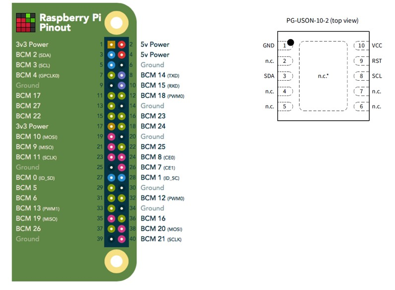
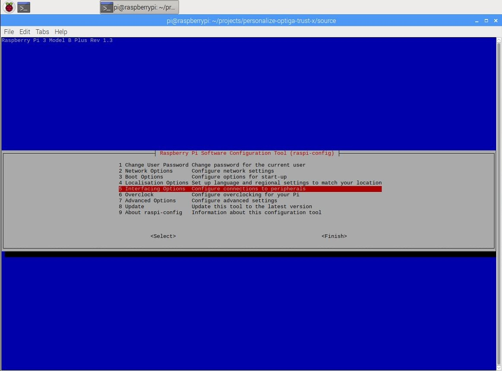
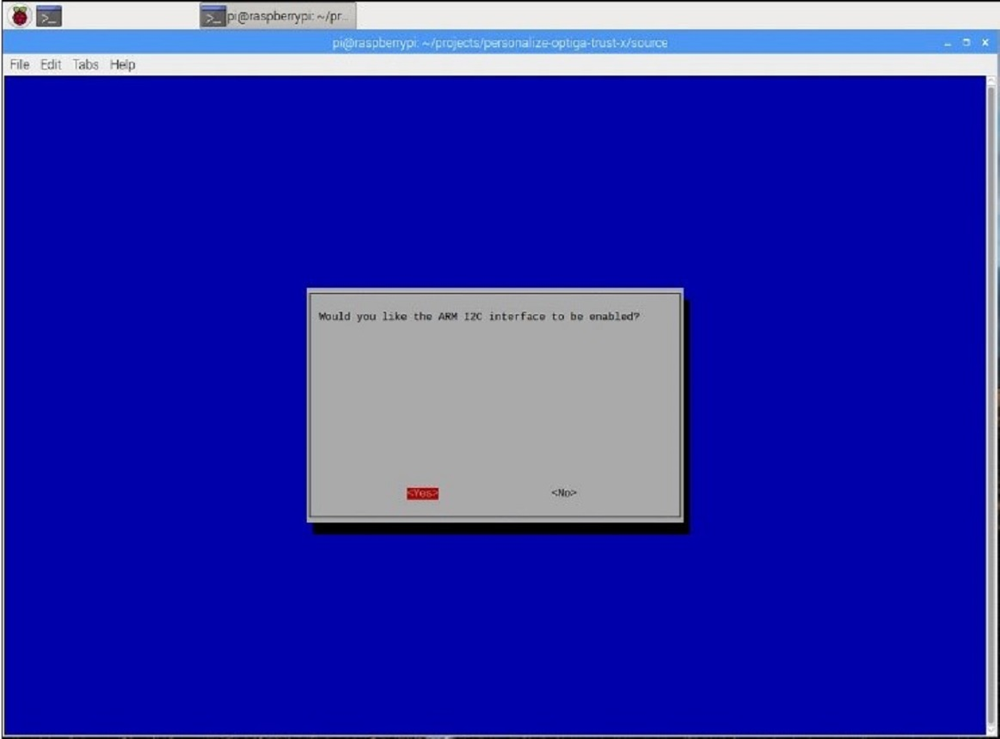
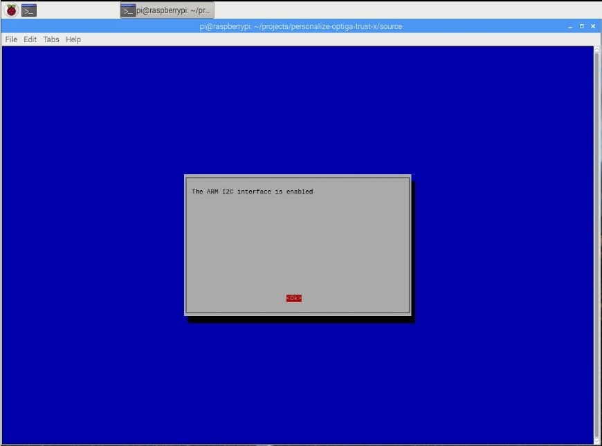
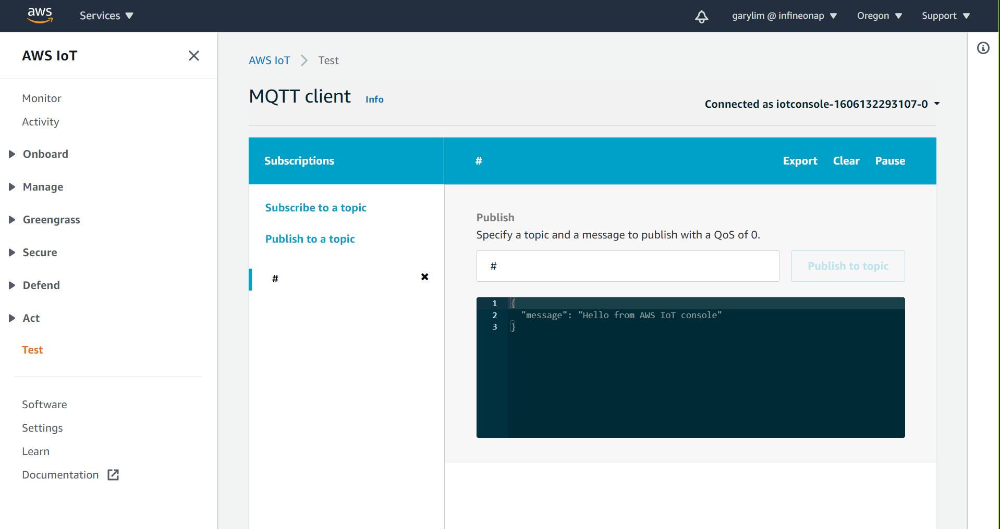
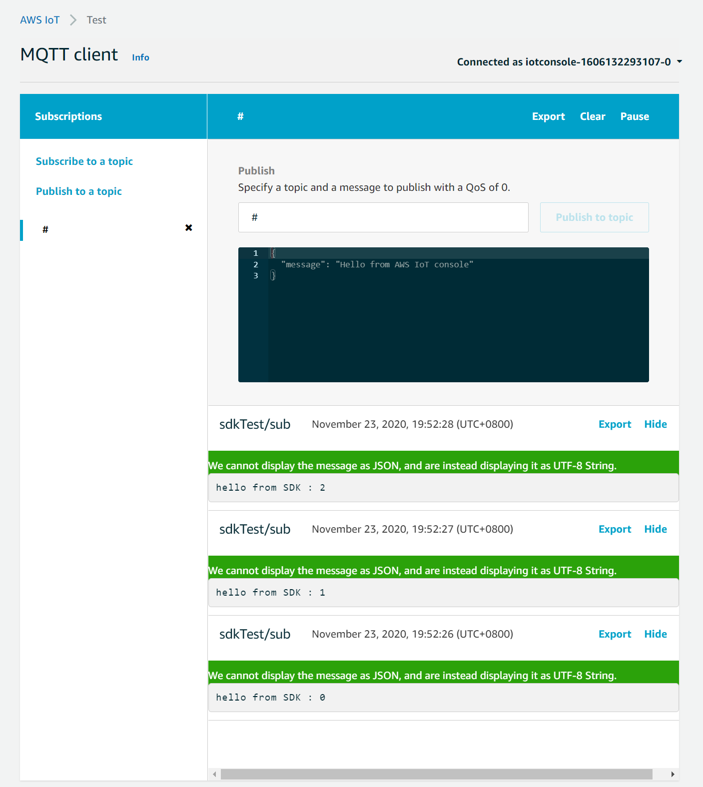

# 1                  Introduction to AWS IoT 

AWS IoT is a public cloud service to connected IoT devices and other AWS services. It provides a managed MQTT server, plus authentication, authorization and device management services. 

 AWS IoT provides secured, bi-directional communication between an Internet-connected T*hing* (the terminology of Thing can be used interchangeably with client, device, or endpoint) and the AWS cloud. This enables the collection of telemetry data from multiple Things, and the storage and analysis of the data. Users can also create applications that enable the control of these devices from mobile phones or tablets.

Things report their state by publishing JSON messages on MQTT topics. Each MQTT topic has a hierarchical name that identifies the Thing whose state is being updated. When a message is published on an MQTT topic, the message is sent to the AWS IoT MQTT message broker, which is responsible for sending all messages published on an MQTT topic to all clients subscribed to that topic.

Communication between a Thing and AWS IoT is protected through the use of Transport Layer Security and mutual authentication using X.509 certificates. AWS IoT can generate a certificate for you or you can use your own. In either case, the certificate must be registered and activated with AWS IoT, and then copied onto your Thing. When your Thing communicates with AWS IoT, it presents the certificate to AWS IoT as a credential to get authenticated and authorized~~.~~

## 1.1              System Prerequisite

The software and configuration in this Application Note has been tested with the following software installed on a Raspberry Pi 3 or 4. The latest version of these software packages can be downloaded and installed from the internet.

-  AWS Account (Free tier is sufficient)
- Raspberry Pi 3/4
- Raspbian Buster (Linux 5.4.72-v7+)
- OpenSSL (tested with version 1.1.1d) 10 Sept 2019
- AWS Command Line Interface (CLI) aws-cli/1.16.113
- WiringPi version 2.5
- Libssl-dev version 1.1.1d-0_deb10u2
- gcc version 8.3.0-6+rpi1
- git version 1:2.20.1-2

## 1.2              Hardware Wiring

 

**Figure 1 Connection of Raspberry Pi 3 to Trust M**

Note: Raspberry Pi 3/4 had I2C pull-up resistors populated on the GPIO pins.

Table 1             

| Trust M Pin | Raspberry Pi Pin | Comments                |
| ----------- | ---------------- | ----------------------- |
| 01          | 06               | Supply Voltage (GND)    |
| 02          |                  | Not Connected           |
| 03          | 03               | Serial Data Line (SDA)  |
| 04          |                  | Not Connected           |
| 05          |                  | Not Connected           |
| 06          |                  | Not Connected           |
| 07          |                  | Not Connected           |
| 08          | 05               | Serial Clock Line (SCL) |
| 09          | 07               | Active Low Reset (RST)  |
| 10          | 01               | Supply Voltage (VCC)    |

  

## 1.3              Enable System I2C Interface

Enables the I2C interface using the raspi-config tool command. Go to option 5 - Interfacing Options.

```
#Enable the Raspberry Pi I2C port
pi@raspberrypi:~ sudo raspi-config 
```

 

**Figure 2 Configure the I2C interface**

          

**Figure 3 Select the I2C interface**

 

**Figure 4 Enable the I2C interface**

 

**Figure 5 I2C interface is enabled**

## 1.4              Preparing the software build Toolchain

Install the require tool chain for Trust M software compilation.

```
#toolchain installation
pi@raspberrypi:~ sudo apt-get install gcc vim cmake git python3 libssl-dev
```

### 1.4.1                   AWS Command Line Interface (CLI) Installation

These steps explains how to setup the AWS CLI which can be used to communicate with AWS IoT core.

**1. Install the AWS CLI by using the following apt-get command.**

```
#installation of AWS CLI
pi@raspberrypi:~ sudo apt-get install awscli
```

**2. Test and check if you already has the AWS CLI install successfully.**

```
#check the AWS version
pi@raspberrypi:~ aws --version
```

 Expected Output:

```
pi@raspberrypi:~ $ aws --version
aws-cli/1.16.113 Python/3.7.3 Linux/5.4.72-v7l+ botocore/1.12.103
```

 

### 1.4.2                   Configuration of AWS Account using AWS CLI

In order to perform any interaction with AWS cloud, the credential must be input using the aws configure command. Details of how to obtain those information can be found in the Quickly Configuring the AWS CLI link.

[External link: Quickly Configuring the AWS CLI](https://docs.aws.amazon.com/cli/latest/userguide/cli-chap-configure.html)

```
#fill in the AWS CLI login credentials
pi@raspberrypi:~ aws configure
AWS Access Key ID [None]: XXXXXXXXXXXXXXXXXXXX
AWS Secret Access Key [None]: XXXXXXXXXXXXX/XXXXXXX/XXXXXXXXXXXXXXXXX
Default region name [None]: XXXXXXXX
Default output format [None]: json
```

 Once the AWS configuration is complete, the aws registration code can be shown using the below command to display the registration code that will be used to generate own CA certificate.

```
pi@raspberrypi:~ $ aws iot get-registration-code
{
 "registrationCode":"XXXXXXXXXXXXXXXXXXXXXXXXXXXXXXXXXXXXXXXXXXXXXXXXXXXXXX"
}
```

 In addition, you can check the current active region endpoint. This information will be used in the MQTT client.

```
$ aws iot describe-endpoint --endpoint-type iot:Data-ATS
{
    "endpointAddress": "XXXXXXXXXXXXX-ats.iot.aws-region.amazonaws.com"
}
```

 

# 2                  Installing the Trust M driver

 

Installing the Trust M driver from GitHub

```
pi@raspberrypi:~/trustm_v3 $ git clone --recurse-submodules https://github.com/Infineon/cli-optiga-trust-m.git
Cloning into 'cli-optiga-trust-m'...
remote: Enumerating objects: 131, done.
remote: Counting objects: 100% (131/131), done.
remote: Compressing objects: 100% (98/98), done.
remote: Total 903 (delta 78), reused 69 (delta 30), pack-reused 772
Receiving objects: 100% (903/903), 919.72 KiB | 1005.00 KiB/s, done.
Resolving deltas: 100% (599/599), done.
Submodule 'trustm_lib' (https://github.com/Infineon/optiga-trust-m.git) registered for path 'trustm_lib'
Cloning into '/home/pi/trustm_v3/cli-optiga-trust-m/trustm_lib'...
remote: Enumerating objects: 457, done.
remote: Counting objects: 100% (457/457), done.
remote: Compressing objects: 100% (349/349), done.
remote: Total 3260 (delta 243), reused 177 (delta 90), pack-reused 2803
Receiving objects: 100% (3260/3260), 75.26 MiB | 3.82 MiB/s, done.
Resolving deltas: 100% (1626/1626), done.
Submodule path 'trustm_lib': checked out 'eaf4203e88b5e8da8318e0d27c338e96c4064cd4'
```

Compile the Trust M library

```
pi@raspberrypi:~/trustm_v3/cli-optiga-trust-m $ make
.......
………..
******* Linking bin/trustm_engine.so
```

Install the Trust M library 

```
pi@raspberrypi:~/trustm_v3/cli-optiga-trust-m $ sudo make install
Create symbolic link to the openssl engine /usr/lib/arm-linux-gnueabihf/engines-1.1/trustm_engine.so
Create symbolic link to trustx_lib /usr/lib/arm-linux-gnueabihf/libtrustm.so
```

Check that the engine has been installed

```
pi@raspberrypi:~/trustm_v3/cli-optiga-trust-m $ openssl engine trustm_engine
(trustm_engine) Infineon OPTIGA TrustM Engine
```

 

# 3                  AWS IoT MQTT Client Configuration

AWS IoT uses X.509 certificates for asymmetric-key based authentication. In this Application Note, the certificate is created using a CSR generated by Trust M private key and the certificate is issued by AWS. The key pair is generated by the user and the device certificate is generated by uploading the CSR to AWS IoT. 

 The structure of the downloaded example:

```
pi@raspberrypi:~/temp/cli-optiga-trust-m/ex_aws-iot-device-sdk-embedded-C-1.1.2 $ ls -l
total 64
drwxr-xr-x 5 pi pi  4096 Nov 23 19:38 aws_iot_src
drwxr-xr-x 4 pi pi  4096 Nov 23 19:38 aws_mqtt_embedded_client_lib
drwxr-xr-x 2 pi pi  4096 Nov 23 19:38 certs
-rw-r--r-- 1 pi pi  2725 Nov 23 19:38 CHANGELOG.md
-rw-r--r-- 1 pi pi 13179 Nov 23 19:38 LICENSE.txt
-rw-r--r-- 1 pi pi   600 Nov 23 19:38 NOTICE.txt
drwxr-xr-x 2 pi pi  4096 Nov 23 19:38 perso
-rw-r--r-- 1 pi pi  9838 Nov 23 19:38 PortingGuide.md
-rw-r--r-- 1 pi pi  7251 Nov 23 19:38 README.md
drwxr-xr-x 5 pi pi  4096 Nov 23 19:38 sample_apps
```

 

Provisioning the Trust M device using the auto_provisioning script located in the perso folder.

Note: Make sure the police is already created in AWS IOT console before running this script

```
pi@raspberrypi:~/temp/cli-optiga-trust-m/ex_aws-iot-device-sdk-embedded-C-1.1.2/perso $ sh auto_provision_to_aws.sh
Client1:-----> Creates new ECC 256 key length and Auth/Enc/Sign usage and generate a certificate request
engine "trustm_engine" set.
Certificate Request:
    Data:
        Version: 1 (0x0)
        Subject: CN = TrustM_Client1
        Subject Public Key Info:
            Public Key Algorithm: id-ecPublicKey
                Public-Key: (256 bit)
                pub:
                    04:a9:1d:e5:57:e2:fb:63:29:3b:1c:cd:ba:ad:b8:
                    d5:2a:57:61:e3:3b:bc:50:2f:5a:d6:2b:89:36:bc:
                    33:e0:d8:39:9b:4b:8a:80:ff:9c:09:8d:4e:fc:ca:
                    49:c8:d6:6d:ef:bb:07:16:6d:3b:13:ee:20:7a:85:
                    63:2a:dd:bc:9b
                ASN1 OID: prime256v1
                NIST CURVE: P-256
        Attributes:
            a0:00
    Signature Algorithm: ecdsa-with-SHA256
         30:45:02:20:5a:3e:ce:ad:36:6b:86:d5:6e:36:08:56:47:bc:
         b9:17:e0:c2:a7:ff:cd:e8:2d:0e:e4:a9:fb:27:38:78:56:7f:
         02:21:00:e7:6f:6e:ba:85:87:33:5d:16:77:61:bc:ba:4a:78:
         86:7c:b9:8f:53:90:f3:f0:b5:4c:f3:89:78:ff:30:8e:a0
-----BEGIN CERTIFICATE REQUEST-----
MIHTMHsCAQAwGTEXMBUGA1UEAwwOVHJ1c3RNX0NsaWVudDEwWTATBgcqhkjOPQIB
BggqhkjOPQMBBwNCAASpHeVX4vtjKTsczbqtuNUqV2HjO7xQL1rWK4k2vDPg2Dmb
S4qA/5wJjU78yknI1m3vuwcWbTsT7iB6hWMq3byboAAwCgYIKoZIzj0EAwIDSAAw
RQIgWj7OrTZrhtVuNghWR7y5F+DCp//N6C0O5Kn7Jzh4Vn8CIQDnb266hYczXRZ3
Yby6SniGfLmPU5Dz8LVM84l4/zCOoA==
-----END CERTIFICATE REQUEST-----
Create AWS CA signed device cert
Creating Thing in AWS Core
{
    "thingName": "TrustM_IOT_DEVICE",
    "thingArn": "arn:aws:iot:aws-region:aws-account-id:thing/TrustM_IOT_DEVICE",
    "thingId": "c0fdb50e-6a58-4971-a669-75341cf7b89b"
}
Attach device Certificate to thing
Attach Policy
Personalization completed
copy temp/client1_e0f1.pem to aws-iot-device-sdk-embedded-C/certs

```


Copy the certificate client1_e0f1.pem from the temp directory to certs folder 

```
pi@raspberrypi:~/temp/cli-optiga-trust-m/ex_aws-iot-device-sdk-embedded-C-1.1.2/perso/temp $ cp client1_e0f1.pem ../../
aws_iot_src/                  CHANGELOG.md                  NOTICE.txt                    README.md
aws_mqtt_embedded_client_lib/ .git/                         perso/                        sample_apps/
certs/                        LICENSE.txt                   PortingGuide.md
pi@raspberrypi:~/temp/cli-optiga-trust-m/ex_aws-iot-device-sdk-embedded-C-1.1.2/perso/temp $ cp client1_e0f1.pem ../../certs/

```


Update the aws_iot_config.h with your AWS IOT endpoint

```
#define AWS_IOT_MQTT_HOST    “ XXXXXXXXXXXXX-ats.iot.aws-region.amazonaws.com“
```

Note:aws-region should be replaced with the region you are using.

 

Execute the source code compilation

```
pi@raspberrypi:~/temp/cli-optiga-trust-m/ex_aws-iot-device-sdk-embedded-C-1.1.2/sample_apps/subscribe_publish_sample $ make
```

Note: There are some compilation warnings due to the SDK version, please ignore them. From AWS IoT Core dashboard, use the Test option follow by subscribing to all the topics using the “#“ on the topic. 

         

**Figure 6 Subscribe to all the published topic** 

 

Launch the software

```
pi@raspberrypi:~/temp/cli-optiga-trust-m/ex_aws-iot-device-sdk-embedded-C-1.1.2/sample_apps/subscribe_publish_sample $ ./subscribe_publish_sample

AWS IoT SDK Version 1.1.2-
--
DEBUG:   main L#149 rootCA /home/pi/temp/cli-optiga-trust-m/ex_aws-iot-device-sdk-embedded-C-1.1.2/sample_apps/subscribe_publish_sample/../../certs/AmazonRootCA1.pem
DEBUG:   main L#150 clientCRT /home/pi/temp/cli-optiga-trust-m/ex_aws-iot-device-sdk-embedded-C-1.1.2/sample_apps/subscribe_publish_sample/../../certs/client1_e0f1.pem
DEBUG:   main L#151 clientKey /home/pi/temp/cli-optiga-trust-m/ex_aws-iot-device-sdk-embedded-C-1.1.2/sample_apps/subscribe_publish_sample/../../certs/0xe0f1:^
Connecting...
DEBUG:   iot_tls_connect L#135 Engine ID : trustm_engine
Subscribing...
-->sleep
-->sleep
Subscribe callback
sdkTest/sub     hello from SDK : 0
-->sleep
Subscribe callback
sdkTest/sub     hello from SDK : 1
->sleep

```


 

**Figure 7 Published message shown in the display** 

 

 

 


 
