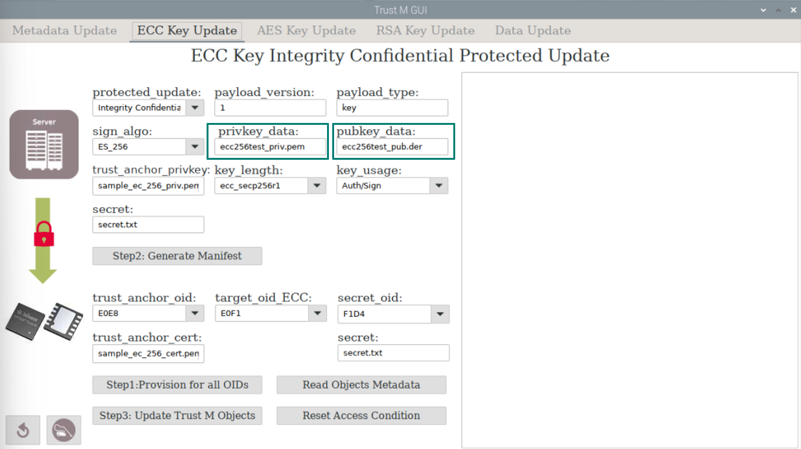

## CURL and NGINX with certificates issuance by Certificate Authority with imported ECC and RSA keys

### Prerequisites

The following examples requires installation of [**OPTIGA™ Trust M Explorer**](https://github.com/Infineon/optiga-trust-m-explorer/blob/master/Setup%20Guide.md#trust-m-explorer-installation-guide)

Download Trust M_Explorer Source Code:  

```
git clone --recurse-submodules https://github.com/Infineon/optiga-trust-m-explorer
```

Go to the following directory

```
cd optiga-trust-m-explorer
```

Execute Installation script:

```
./trust_m_installation_script.sh
```

After installation completed, go to the scripts directory as follow

```shell
cd Python_TrustM_GUI/linux-optiga-trust-m/scripts/curl_nginx_imported_key
```

The usage parameters in "config.sh" can be configured depends on application [config.sh](./config.sh)

(see [req](#req) for input details)

```sh
#~ Server certificate related defintions
SERVER_CSR=server1.csr
SERVER_CERT_NAME=server1.crt.pem
SERVER_PRIVATE_KEY=server1_privkey.pem

#~ Client certificate related definitions
CLIENT_CSR=client1.csr
CLIENT_CERT_NAME=client1.crt.pem
CLIENT_PRIVATE_KEY=client1_privkey.pem
CLIENT_PUBKEY_KEY=client1_pubkey.pem
CLIENT_PUBKEY_KEY_DER=client1_pubkey.der

#~ Certificate Authority related parameters
## Note: do not use this as productive key or certifiacte
CA_KEY=$CERT_PATH/OPTIGA_Trust_M_Infineon_Test_CA_Key.pem
CA_CERT=$CERT_PATH/OPTIGA_Trust_M_Infineon_Test_CA.pem

#~ Optiga Trust M Key OIDs definitions, 
## RSA Key parameters
TRUST_M_RSA_KEY_EXT_OID=0xe0fc:$CLIENT_PUBKEY_KEY
TRUST_M_RSA_KEY_OID=0xe0fc:^
TRUST_M_RSA_KEY_GEN=0xe0fc:^:NEW:0x42:0x13
TRUST_M_RSA_PUBKEY_OID=0xf1e0
## ECC Key parameters
TRUST_M_ECC_KEY_EXT_OID=0xe0f1:$CLIENT_PUBKEY_KEY
TRUST_M_ECC_KEY_OID=0xe0f1:^
TRUST_M_ECC_KEY_GEN=0xe0f1:^:NEW:0x03:0x13
TRUST_M_ECC_PUBKEY_OID=0xf1d1
```

###   Step 1: Server Key generation, Certificate Issuance and NGINX Setup

Run the [step1_generate_keys.sh](./step1_generate_keys.sh) , the server and client keys will be generated. Then the corresponding certificates will be issued by a test Certificate Authority(CA).

*Note: Do not use this Test CA in productive usage*

This will also setup the NGINX server to use openssl, setting the server key and certificate to use in the default file setting(/etc/nginx/sites-enabled/default). The nginx service will be restarted for the new settings to take effect. 

```sh
echo "Server1: -----> Generate Server ECC Private Key"
openssl ecparam -out $SERVER_PRIVATE_KEY -name prime256v1 -genkey
echo "Server1:-----> Generate Server ECC Keys CSR"
openssl req -new  -key $SERVER_PRIVATE_KEY -subj /CN=127.0.0.1/O=Infineon/C=SG -out $SERVER_CSR
echo "Server1:-----> Generate Server cetificate by using CA"
openssl x509 -req -in $SERVER_CSR -CA $CA_CERT  -CAkey $CA_KEY -CAcreateserial -out $SERVER_CERT_NAME -days 3650 -sha256 -extfile openssl.cnf -extensions cert_ext
#~ openssl x509 -in server1.crt -text -purpose

echo "Server1:-----> Configure NGINX"
sudo cp default /etc/nginx/sites-enabled/default
sudo cp $SERVER_CERT_NAME /etc/nginx/$SERVER_CERT_NAME
sudo cp $SERVER_PRIVATE_KEY /etc/nginx/$SERVER_PRIVATE_KEY
sudo service nginx restart
```

After running the steps above, the following changes will be made to "default" file:

```
listen 443 ssl default_server;
listen [::]:443 ssl default_server;
ssl_certificate server1.crt.pem; 
ssl_certificate_key server1_privkey.pem;
```

###  Step 2: Client Key generation and Certificate Issuance

Run the step 2 ECC or RSA script as needed. 

#### ECC Keys Generation

This will generate client private key(ECC 256, Auth/Enc/Sing) in OPTIGA™ Trust M using using OID 0xe0f1 and certificate "client1.crt.pem". Client public key is extracted from the certificate for later usage. 

[step2_ECC_client_generate_keys.sh](./step2_ECC_client_generate_keys.sh)

```sh
echo "Client1: -----> Generate Client ECC Private Key"
openssl ecparam -out $CLIENT_PRIVATE_KEY -name prime256v1 -genkey
echo "Client1:-----> Generate Client ECC Keys CSR"
openssl req -new  -key $CLIENT_PRIVATE_KEY -subj "/CN=TrustM/O=Infineon/C=SG" -out $CLIENT_CSR
echo "Client1:-----> Generate Client cetificate by using CA"
openssl x509 -req -in $CLIENT_CSR -CA $CA_CERT  -CAkey $CA_KEY -CAcreateserial -out $CLIENT_CERT_NAME -days 3650 -sha256 -extfile openssl.cnf -extensions cert_ext1
echo "Client1:-----> Extracting public key in PEM and DER from certificate"
openssl x509 -pubkey -noout -in $CLIENT_CERT_NAME  > $CLIENT_PUBKEY_KEY
openssl x509 -pubkey -noout -in $CLIENT_CERT_NAME | openssl enc -base64 -d > $CLIENT_PUBKEY_KEY_DER
```

#### RSA Keys Generation

[step2_RSA_client_generate_keys.sh](./step2_RSA_client_generate_keys.sh)

```sh
echo "Client1: -----> Generate Client RSA Private Key"
openssl genrsa -out $CLIENT_PRIVATE_KEY 2048
echo "Client1:-----> Generate Client RSA Keys CSR"
openssl req -new  -key $CLIENT_PRIVATE_KEY -subj "/CN=TrustM/O=Infineon/C=SG" -out $CLIENT_CSR
echo "Client1:-----> Generate Client cetificate by using CA"
openssl x509 -req -in $CLIENT_CSR -CA $CA_CERT  -CAkey $CA_KEY -CAcreateserial -out $CLIENT_CERT_NAME -days 3650 -sha256 -extfile openssl.cnf -extensions cert_ext1
echo "Client1:-----> Extracting public key in PEM and DER from certificate"
openssl x509 -pubkey -noout -in $CLIENT_CERT_NAME  > $CLIENT_PUBKEY_KEY
openssl x509 -pubkey -noout -in $CLIENT_CERT_NAME | openssl enc -base64 -d > $CLIENT_PUBKEY_KEY_DER

```

### Step 3: Protected Update of Keys

Run the [step3_client_import_private_key.sh](./step3_client_import_private_key.sh). This will start the **OPTIGA™ Trust M Explorer**

|  |
| ----------------------- |

#### Protected Update of ECC Key

Click on the "key_data" field and select the file "**client1_privkey.pem**" in the current directory.

Click **Step1**, **Step2** and **Step3** buttons. Click **Reset Access Condition** to restart the procedure.

|  |
| ---------------------- |

#### Protected Update of RSA Key

Click on the "key_data" field and select the file "client1_privkey.pem" in the current directory and ensure that "RSA_2048" is selected.

Click **Step1**, **Step2** and **Step3** buttons. Click **Reset Access Condition** to restart the procedure.

|  |
| ---------------------- |

### Step 4: Update Public Key store

Run the following to update the corresponding ECC/RSA key store in application data object of OPTIGA™ Trust M

For ECC:[step4_ECC_client_update_pubkey.sh](./step4_ECC_client_update_pubkey.sh)

```sh
echo "Client1:-----> Update Public key into Optiga Trust M"
$EXEPATH/trustm_data -w $TRUST_M_ECC_PUBKEY_OID -i client1_pubkey.der
```

For RSA:[step4_RSA_client_update_pubkey.sh](./step4_RSA_client_update_pubkey.sh)

```sh
echo "Client1:-----> Update Public key into Optiga Trust M"
$EXEPATH/trustm_data -w $TRUST_M_RSA_PUBKEY_OID -i client1_pubkey.der
```

### Step 5: Testing CURL Client with OPTIGA™ Trust M Key 

This will connect the Client to the web server with engine key interface using OPTIGA™ Trust M.  

For ECC:[step5_ECC_test_curl_client.sh](./step5_ECC_test_curl_client.sh)

```sh
## Using internal public key
echo "Client1:-----> test curl client ECC with 0xe0f1:^ "
curl -v --engine trustm_engine --key-type ENG --key $TRUST_M_ECC_KEY_OID --cert $CLIENT_CERT_NAME --cacert $CA_CERT https://127.0.0.1
```

or with public key file as follow

```sh
## Using External public key
echo "Client1:-----> test curl client RSA with 0xe0f1:client1_pubkey.pem "
curl -v --engine trustm_engine --key-type ENG --key $TRUST_M_ECC_KEY_EXT_OID --cert $CLIENT_CERT_NAME --cacert $CA_CERT https://127.0.0.1

```

For RSA:[step5_RSA_test_curl_client.sh](./step5_RSA_test_curl_client.sh)

```sh
## Using internal public key
echo "Client1:-----> test curl client RSA with 0xe0fc:^ "
curl -v --engine trustm_engine --key-type ENG --key $TRUST_M_RSA_KEY_OID --cert $CLIENT_CERT_NAME --cacert $CA_CERT https://127.0.0.1
```

or with public key file as follow

```sh
## Using External public key
echo "Client1:-----> test curl client RSA with 0xe0fc:client1_pubkey.pem "
curl -v --engine trustm_engine --key-type ENG --key $TRUST_M_RSA_KEY_EXT_OID --cert $CLIENT_CERT_NAME --cacert $CA_CERT https://127.0.0.1
```

Result after successful TLS connection

|  |
| ----------------------- |

### 
