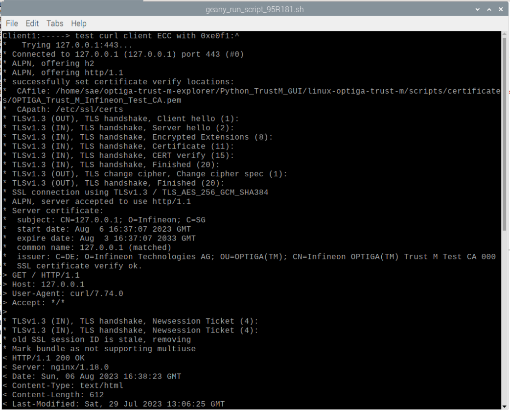
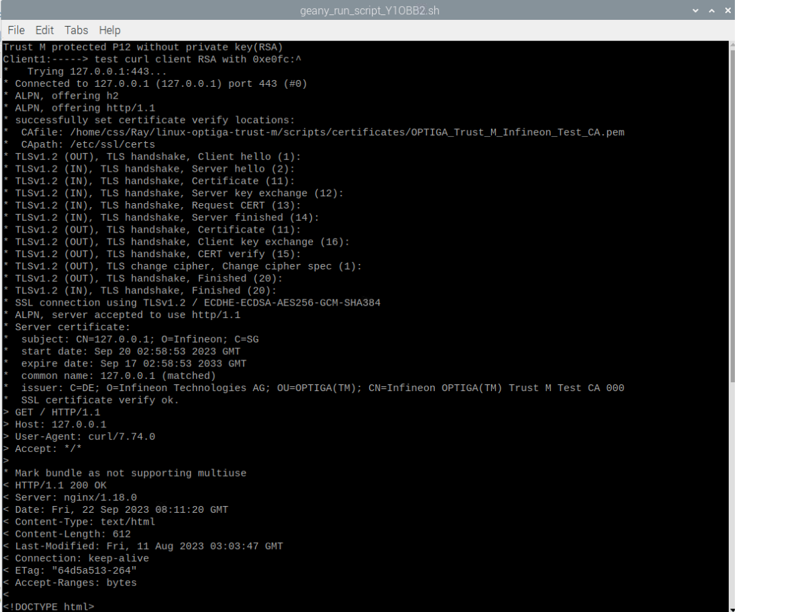

## CURL and NGINX example with HSM protected Key OID P12 file

### Prerequisites

Clone the repository from Github with submodules:  

```
git clone --recurse-submodules https://github.com/Infineon/linux-optiga-trust-m.git
```

Go to the following directory:

```
cd linux-optiga-trust-m/
```

Execute Installation script below to install the required dependencies and Linux tools for Optiga Trust M:

```
./trust_m_installation_script.sh
```

Note: For 64bit system, please run the installation scripts for aarch64. 

After installation completed, go to the directory as follow

```shell
cd scripts/curl_nginx_imported_key/curl_nginx_hsm_protected_p12
```

The usage parameters in "config.sh" can be configured depends on application [config.sh](./config.sh)

```sh
#~ Client certificate related definitions
TEMP_PUBKEY_KEY_ECC=./generate_p12/temp_pubkey_ecc.pem
TEMP_PUBKEY_KEY_DER_ECC=./generate_p12/temp_pubkey_ecc.der
TEMP_PUBKEY_KEY_RSA=./generate_p12/temp_pubkey_rsa.pem
TEMP_PUBKEY_KEY_DER_RSA=./generate_p12/temp_pubkey_rsa.der
TEMP_KEY_ECC=./generate_p12/client1_ecc_privkey.pem
TEMP_CERT_ECC=./generate_p12/client1_ecc.crt.pem
TEMP_KEY_RSA=./generate_p12/client1_rsa_privkey.pem
TEMP_CERT_RSA=./generate_p12/client1_rsa.crt.pem


#Protected update relate definitions
PAYLOAD_VER=2
TRUST_ANCHOR=e0e8
TARGET_OID_ECC=e0f1
TARGET_OID_RSA=e0fc
PUBKEY_OID_ECC=f1d1
PUBKEY_OID_RSA=f1e0
SECRET_OID=f1d4
SIGN_ALGO=ES_256
PRIV_KEY=$CERT_PATH/sample_ec_256_priv.pem
SECRET=./generate_p12/secret.txt

#~ Server certificate related defintions
SERVER_CSR=server1.csr
SERVER_CERT_NAME=server1.crt.pem
SERVER_PRIVATE_KEY=server1_privkey.pem

#~ Certificate Authority related parameters
## Note: do not use this as productive key or certifiacte
CA_KEY=$CERT_PATH/OPTIGA_Trust_M_Infineon_Test_CA_Key.pem
CA_CERT=$CERT_PATH/OPTIGA_Trust_M_Infineon_Test_CA.pem
```


### Step 1: Generate p12 file with private key protected by Trust M

Go to the corresponding folder:

```shell
cd scripts/curl_nginx_imported_key/curl_nginx_hsm_protected_p12/generate_p12
```

Generate p12 file with private key protected by Trust M:

For ECC: [step1_ECC_genetrate_p12_files_nokey.sh](./step1_ECC_genetrate_p12_files_nokey.sh)

```sh
echo "Client1:-----> Extracting public key in PEM and DER from certificate"
openssl x509 -pubkey -noout -in client1_ecc.crt.pem  > temp_pubkey_ecc.pem
openssl x509 -pubkey -noout -in client1_ecc.crt.pem | openssl enc -base64 -d > temp_pubkey_ecc.der

echo "Client1:-----> Generate p12 file without key inside"
openssl pkcs12 -nodes -export -nokeys -password  pass:1234 -in client1_ecc.crt.pem -out e0f1.p12
openssl pkcs12 -info -in e0f1.p12 -password  pass:1234
echo "Client1:-----> Copy p12 file to destination"
cp e0f1.p12 ../
#~ cp temp_pubkey.pem ../
cp temp_pubkey_ecc.der ../
```

For RSA: [step1_RSA_genetrate_p12_files_nokey.sh](./step1_ECC_genetrate_p12_files_nokey.sh)

```sh
echo "Client1:-----> Extracting public key in PEM and DER from certificate"
openssl x509 -pubkey -noout -in client1_rsa.crt.pem  > temp_pubkey_rsa.pem
openssl x509 -pubkey -noout -in client1_rsa.crt.pem | openssl enc -base64 -d > temp_pubkey_rsa.der

echo "Client1:-----> Generate p12 file without key inside"
openssl pkcs12 -nodes -export -nokeys -password  pass:1234 -in client1_rsa.crt.pem -out e0fc.p12
openssl pkcs12 -info -in e0fc.p12 -password  pass:1234
echo "Client1:-----> Copy p12 file to destination"
cp e0fc.p12 ../
#~ cp temp_pubkey.pem ../
cp temp_pubkey_rsa.der ../
```


###   Step 2: Server Key generation, Certificate Issuance and NGINX Setup

Return to the previous directory

```shell
cd ..
```

Run the script below:

```shell
./step0_server_generate_keys.sh
```

The server key will be generated. Then the corresponding certificates will be issued by a test Certificate Authority(CA).

*Note: Do not use this Test CA in productive usage*

This will also setup the NGINX server to use openssl, setting the server key and certificate to use in the default file setting(/etc/nginx/sites-enabled/default). The nginx service will be restarted for the new settings to take effect. 

```sh
echo "Server1: -----> Generate Server ECC Private Key"
openssl ecparam -out $SERVER_PRIVATE_KEY -name prime256v1 -genkey
echo "Server1:-----> Generate Server ECC Keys CSR"
openssl req -new  -key $SERVER_PRIVATE_KEY -subj /CN=127.0.0.1/O=Infineon/C=SG -out $SERVER_CSR
echo "Server1:-----> Generate Server cetificate by using CA"
openssl x509 -req -in $SERVER_CSR -CA $CA_CERT  -CAkey $CA_KEY -CAcreateserial -out $SERVER_CERT_NAME -days 3650 -sha256 -extfile openssl.cnf -extensions cert_ext
#~ openssl x509 -in server1.crt -text -purpose

echo "Server1:-----> Configure NGINX"
sudo cp default /etc/nginx/sites-enabled/default
sudo cp $SERVER_CERT_NAME /etc/nginx/$SERVER_CERT_NAME
sudo cp $SERVER_PRIVATE_KEY /etc/nginx/$SERVER_PRIVATE_KEY
sudo cp $CA_CERT /etc/nginx/OPTIGA_Trust_M_Infineon_Test_CA.pem
sudo service nginx restart
```

After running the steps above, the following changes will be made to "default" file:

```
listen 443 ssl default_server;
listen [::]:443 ssl default_server;
ssl_certificate server1.crt.pem; 
ssl_certificate_key server1_privkey.pem;
ssl_client_certificate OPTIGA_Trust_M_Infineon_Test_CA.pem;
ssl_verify_client on;
```


###  Step 3: Import ECC/RSA key into TrustM

Run the following scripts in sequence:

For ECC:

1. Resetting the access condition for ECC key : [./step0_reset_ecc_condition.sh](./step0_reset_ecc_condition.sh)

   ECC Key Slot 0xE0F1 is used here as example.

```shell
RESET="2005d003e1fc07"
echo $RESET | xxd -r -p > access_reset.bin
$EXEPATH/trustm_metadata -w 0xE0F1 -F access_reset.bin
$EXEPATH/trustm_metadata -r 0xE0F1
```

2) Provisioning for the ECC protected update: [./step0_protected_update_ecc_provisioning.sh](./step0_protected_update_ecc_provisioning.sh)

```shell
#### Configurable Variables Start

## Trust Anchor OID and Metadata settings for integrity protect
# Trust Anchor OID
TRUST_ANCHOR_OID=e0e8
# Trust Anchor metadata setting
TRUST_ANCHOR_META="2003E80111"

## PROTECTED UPDATE OID and Metadata settings for confidentiality protect
# Protected Update OID
PROTECTED_UPDATE_SECRET_OID=f1d4
# Shared Secret Data, must match with the host C codes
PROTECTED_UPDATE_SECRET="49C9F492A992F6D4C54F5B12C57EDB27CED224048F25482AA149C9F492A992F649C9F492A992F6D4C54F5B12C57EDB27CED224048F25482AA149C9F492A992F6"
# Protected Update OID metadata setting
PROTECTED_UPDATE_SECRET_META="200BD103E1FC07D30100E80123"

# Target OID
TARGET_OID=e0f1
# Target OID metadata setting for ECC Key protected update
TARGET_OID_META="200dC1020000D00721${TRUST_ANCHOR_OID}FD20${PROTECTED_UPDATE_SECRET_OID}"

echo "Prepare binary protected update secret."
echo $PROTECTED_UPDATE_SECRET | xxd -r -p > protected_update_secret.dat


#### Configurable Variables End

for i in $(seq 1 1); do
echo "test $i"

echo "Step1: Provisioning initial Trust Anchor, metadata for Trust Anchor"
echo "Write sample_ec_256_cert.pem into 0x$TRUST_ANCHOR_OID"
$EXEPATH/trustm_cert -w 0x$TRUST_ANCHOR_OID -i $CERT_PATH/sample_ec_256_cert.pem
echo "Set device type to TA for 0x$TRUST_ANCHOR_OID "
echo $TRUST_ANCHOR_META | xxd -r -p > trust_anchor_metadata.bin
echo "Printout trust_anchor_metadata.bin"
xxd trust_anchor_metadata.bin
echo "write trust_anchor_metadata.bin as metadata of 0x$TRUST_ANCHOR_OID"
$EXEPATH/trustm_metadata -w 0x$TRUST_ANCHOR_OID -F trust_anchor_metadata.bin
echo "Read out metadata for 0x$TRUST_ANCHOR_OID"
$EXEPATH/trustm_metadata -r  0x$TRUST_ANCHOR_OID

echo "Step2: Provisioning Protected Update Secret OID, metadata for Protected Update Secret OID"
echo "Write Protected Update Secret into 0x$PROTECTED_UPDATE_SECRET_OID"
$EXEPATH/trustm_data -e -w 0x$PROTECTED_UPDATE_SECRET_OID -i protected_update_secret.dat
echo "Set device type to UPDATSEC for 0x$PROTECTED_UPDATE_SECRET_OID "
echo $PROTECTED_UPDATE_SECRET_META | xxd -r -p > protected_update_secret_metadata.bin
echo "Printout protected_update_secret_metadata.bin"
xxd protected_update_secret_metadata.bin
echo "write protected_update_secret_metadata.bin as metadata of 0x$PROTECTED_UPDATE_SECRET_OID"
$EXEPATH/trustm_metadata -w 0x$PROTECTED_UPDATE_SECRET_OID -F protected_update_secret_metadata.bin
echo "Read out metadata for 0x$PROTECTED_UPDATE_SECRET_OID"
$EXEPATH/trustm_metadata -r  0x$PROTECTED_UPDATE_SECRET_OID

echo "Step3: Provisioning metadata for 0x$TARGET_OID"
echo "Set AES protected update for 0x$TARGET_OID (Provision for Protected Update)"
echo $TARGET_OID_META | xxd -r -p > targetOID_metadata.bin
echo "Printout targetOID_metadata.bin"
xxd targetOID_metadata.bin
echo "Write targetOID_metadata.bin as metadata of 0x$TARGET_OID"
$EXEPATH/trustm_metadata -w 0x$TARGET_OID -F targetOID_metadata.bin
echo "Read out metadata for 0x$TARGET_OID"
$EXEPATH/trustm_metadata -r  0x$TARGET_OID 

sleep 1
done
```

3) Importing ECC key into Trust M: [./step1_import_ecc_key.sh ](./step1_import_ecc_key.sh )

```shell
echo "Client1:-----> Update Public key store into Optiga Trust M"
$EXEPATH/trustm_data -w 0x$PUBKEY_OID_ECC -i $TEMP_PUBKEY_KEY_DER_ECC -e

echo "Client1:-----> Generate Manifest"
$UPDATEPATH/trustm_protected_update_set payload_version=$PAYLOAD_VER trust_anchor_oid=$TRUST_ANCHOR target_oid=$TARGET_OID_ECC sign_algo=$SIGN_ALGO priv_key=$PRIV_KEY payload_type=key key_algo=03 key_usage=10 key_data=$TEMP_KEY_ECC secret=$SECRET label="ecc_key" seed_length=64 enc_algo="AES-CCM-16-64-128" secret_oid=$SECRET_OID
#~ rm $TEMP_KEY
echo "Protected ECC Key Update for 0x$TARGET_OID_ECC"
$EXEPATH/trustm_protected_update_ecckey -k 0x$TARGET_OID_ECC -m manifest1.dat -f fragment1.dat
echo "read out metadata for 0x$TARGET_OID_ECC"
$EXEPATH/trustm_metadata -r  0x$TARGET_OID_ECC -X
```


For RSA:

1. Resetting the access condition for RSA key : [./step0_reset_rsa_condition.sh](./step0_reset_rsa_condition.sh)

   RSA Key Slot 0xE0FC is used here as example.

```shell
RESET="2005d003e1fc07"
echo $RESET | xxd -r -p > access_reset.bin
$EXEPATH/trustm_metadata -w 0xE0FC -F access_reset.bin
$EXEPATH/trustm_metadata -r 0xE0FC
```

2. Provisioning for the RSA protected update : [./step0_protected_update_rsa_provisioning.sh](./step0_protected_update_rsa_provisioning.sh)

```shell
#### Configurable Variables Start

## Trust Anchor OID and Metadata settings for integrity protect
# Trust Anchor OID
TRUST_ANCHOR_OID=e0e8
# Trust Anchor metadata setting
TRUST_ANCHOR_META="2003E80111"

## PROTECTED UPDATE OID and Metadata settings for confidentiality protect
# Protected Update OID
PROTECTED_UPDATE_SECRET_OID=f1d4
# Shared Secret Data, must match with the host C codes
PROTECTED_UPDATE_SECRET="49C9F492A992F6D4C54F5B12C57EDB27CED224048F25482AA149C9F492A992F649C9F492A992F6D4C54F5B12C57EDB27CED224048F25482AA149C9F492A992F6"
# Protected Update OID metadata setting
PROTECTED_UPDATE_SECRET_META="200BD103E1FC07D30100E80123"

# Target OID
TARGET_OID=e0fc
# Target OID metadata setting for ECC Key protected update
TARGET_OID_META="200dC1020000D00721${TRUST_ANCHOR_OID}FD20${PROTECTED_UPDATE_SECRET_OID}"

echo "Prepare binary protected update secret."
echo $PROTECTED_UPDATE_SECRET | xxd -r -p > protected_update_secret.dat


#### Configurable Variables End

for i in $(seq 1 1); do
echo "test $i"

echo "Step1: Provisioning initial Trust Anchor, metadata for Trust Anchor"
echo "Write sample_ec_256_cert.pem into 0x$TRUST_ANCHOR_OID"
$EXEPATH/trustm_cert -w 0x$TRUST_ANCHOR_OID -i $CERT_PATH/sample_ec_256_cert.pem
echo "Set device type to TA for 0x$TRUST_ANCHOR_OID "
echo $TRUST_ANCHOR_META | xxd -r -p > trust_anchor_metadata.bin
echo "Printout trust_anchor_metadata.bin"
xxd trust_anchor_metadata.bin
echo "write trust_anchor_metadata.bin as metadata of 0x$TRUST_ANCHOR_OID"
$EXEPATH/trustm_metadata -w 0x$TRUST_ANCHOR_OID -F trust_anchor_metadata.bin
echo "Read out metadata for 0x$TRUST_ANCHOR_OID"
$EXEPATH/trustm_metadata -r  0x$TRUST_ANCHOR_OID

echo "Step2: Provisioning Protected Update Secret OID, metadata for Protected Update Secret OID"
echo "Write Protected Update Secret into 0x$PROTECTED_UPDATE_SECRET_OID"
$EXEPATH/trustm_data -e -w 0x$PROTECTED_UPDATE_SECRET_OID -i protected_update_secret.dat
echo "Set device type to UPDATSEC for 0x$PROTECTED_UPDATE_SECRET_OID "
echo $PROTECTED_UPDATE_SECRET_META | xxd -r -p > protected_update_secret_metadata.bin
echo "Printout protected_update_secret_metadata.bin"
xxd protected_update_secret_metadata.bin
echo "write protected_update_secret_metadata.bin as metadata of 0x$PROTECTED_UPDATE_SECRET_OID"
$EXEPATH/trustm_metadata -w 0x$PROTECTED_UPDATE_SECRET_OID -F protected_update_secret_metadata.bin
echo "Read out metadata for 0x$PROTECTED_UPDATE_SECRET_OID"
$EXEPATH/trustm_metadata -r  0x$PROTECTED_UPDATE_SECRET_OID

echo "Step3: Provisioning metadata for 0x$TARGET_OID"
echo "Set AES protected update for 0x$TARGET_OID (Provision for Protected Update)"
echo $TARGET_OID_META | xxd -r -p > targetOID_metadata.bin
echo "Printout targetOID_metadata.bin"
xxd targetOID_metadata.bin
echo "Write targetOID_metadata.bin as metadata of 0x$TARGET_OID"
$EXEPATH/trustm_metadata -w 0x$TARGET_OID -F targetOID_metadata.bin
echo "Read out metadata for 0x$TARGET_OID"
$EXEPATH/trustm_metadata -r  0x$TARGET_OID 

sleep 1
done
```

3. Importing RSA key into Trust M: [./step1_import_rsa_key.sh ](./step1_import_rsa_key.sh )

```shell
echo "Client1:-----> Update Public key store into Optiga Trust M"
$EXEPATH/trustm_data -w 0x$PUBKEY_OID_RSA -i $TEMP_PUBKEY_KEY_DER_RSA -e

echo "Client1:-----> Generate Manifest"
$UPDATEPATH/trustm_protected_update_set payload_version=$PAYLOAD_VER trust_anchor_oid=$TRUST_ANCHOR target_oid=$TARGET_OID_RSA sign_algo=$SIGN_ALGO priv_key=$PRIV_KEY payload_type=key key_algo=66 key_usage=13 key_data=$TEMP_KEY_RSA secret=$SECRET label="rsa_key" seed_length=64 enc_algo="AES-CCM-16-64-128" secret_oid=$SECRET_OID

echo "Protected RSA Key Update for 0x$TARGET_OID_RSA"
$EXEPATH/trustm_protected_update_rsakey -k 0x$TARGET_OID_RSA -m manifest1.dat -f fragment1.dat
echo "read out metadata for 0x$TARGET_OID_RSA"
$EXEPATH/trustm_metadata -r  0x$TARGET_OID_RSA -X
```


### Step 4: Testing CURL Client with OPTIGA™ Trust M Key 

This will connect the Client to the web server with engine interface using OPTIGA™ Trust M.  

For ECC: [step2_ECC_test_curl_client.sh](./step2_ECC_test_curl_client.sh)

```sh
echo "Trust M protected P12 without private key(ECC)"
 
sudo cp openssl_curl.cnf /etc/ssl/openssl_curl.cnf

export OPENSSL_CONF=/etc/ssl/openssl_curl.cnf  

curl -v --engine trustm_engine --cert-type ENG  --cert e0f1.p12 --cacert $CA_CERT https://127.0.0.1
```

Result after successful TLS connection:



For RSA: [step2_RSA_test_curl_client.sh](./step2_RSA_test_curl_client.sh)

```sh
echo "Trust M protected P12 without private key(RSA)"

sudo cp openssl_curl_rsa.cnf /etc/ssl/openssl_curl_rsa.cnf

export OPENSSL_CONF=/etc/ssl/openssl_curl_rsa.cnf  

echo "Client1:-----> test curl client RSA with 0xe0fc:^ "
curl -v --engine trustm_engine --tls-max 1.2 --cert-type ENG  --cert e0fc.p12 --cacert $CA_CERT https://127.0.0.1
```

Result after successful TLS connection:

|  |
| ----------------------- |

### 
