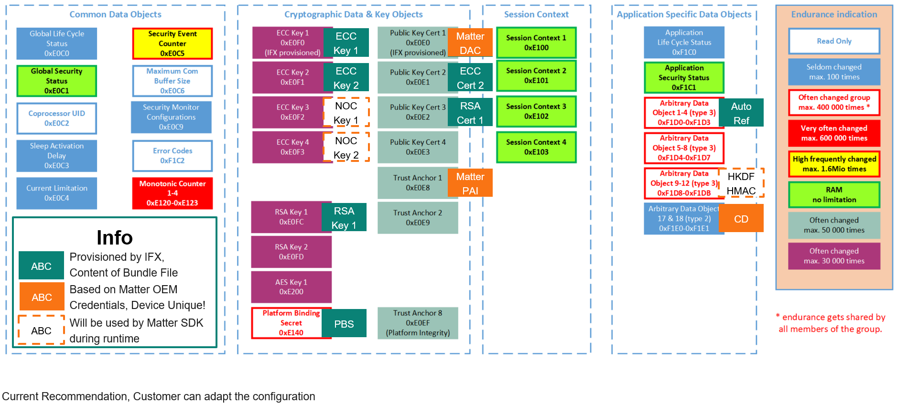

# Matter Provisioning
This folder contains scripts to make the provisioning of Matter credentials simple and easy.

## OPTIGA™ Trust M Matter-ready Object Map



The above image shows the state of the OPTIGA™ Trust M Matter-ready *after* this provisioning mechanism.

Noted in ocean green color are the objects provisioned by Infineon, like the ECC and RSA Keys and Certificates. This is also information, which can be retrieved from the Cloud Service Provider, who also hosts the CSA certified Matter PKI.

This Cloud Service Provider is used by Matter OEMs to generate device individual Matter Device Attestation Certificates (DACs) and download them in the form of a Bundle File per Reel (4k pcs) or per evaluation sample (1 pcs).

The information inside the bundle file, containing (at least) Matter DAC, PAI and CD is then provisioned to the OPTIGA™ Trust M Matter-ready via the following scripts, adding the orange colored objects to the Secure Element.

Subsequently, the OPTIGA™ Trust M Matter-ready contains the following objects:

|   Object ID | Description                 | Relationship                       | Recommended LcsO | Read | Change      | Execute | Provisioned By |
|------------:|-----------------------------|------------------------------------|------------------|------|-------------|---------|----------------|
|      0xE0F0 | ECC NIST P256 Private Key 1 | Bound to Cert in 0xE0E0 and 0xE0E3 | Operational      | NEV  | PBS & Auto* | ALW     | IFX            |
|      0xE0F1 | ECC NIST P256 Private Key 2 | Bound to Cert in 0xE0E1            | Operational      | NEV  | PBS & Auto* | PBS     | IFX            |
|      0xE0FC | RSA 2048 Private Key 1      | Bound to Cert in 0xE0FC            | Operational      | NEV  | PBS & Auto* | ALW     | IFX            |
|      0xE0E0 | ECC Certificate 1           | Bound to Key in 0xE0F0             | Termination      | ALW  | PBS & Auto  | ALW     | IFX            |
|      0xE0E1 | ECC Certificate 2           | Bound to Key in 0xE0F1             | Operational      | PBS  | PBS & Auto  | PBS     | IFX            |
|      0xE0E2 | RSA Certificate 1           | Bound to Key in 0xE0FC             | Operational      | ALW  | PBS & Auto  | ALW     | IFX            |
|      0xE0E3 | Matter DAC                  | Bound to Key in 0xE0F0             | Operational      | ALW  | PBS & Auto  | ALW     | OEM            |
|      0xE0E8 | Matter PAI                  |                                    | Operational      | ALW  | PBS & Auto  | ALW     | OEM            |
|      0xE140 | Plattform Binding Secret    |                                    | Operational      | NEV  | PBS & Auto  | ALW     | IFX            |
|      0xF1D0 | Authorization Reference     |                                    | Operational      | NEV  | PBS & Auto  | PBS     | IFX            |
|      0xF1E0 | Matter CD                   |                                    | Operational      | ALW  | PBS & Auto  | ALW     | OEM            |
|    0xE0E9** | Matter NOC                  |                                    | Operational      | ALW  | ALW         | ALW     | Application    |
| 0xF1D8/D9** | Matter HKDF & HMAC          |                                    | Operational      | ALW  | ALW         | ALW     | Application    |

\* Keys can never be written to directly, they can only be generated through the OPTIGA™ Trust M functions.

** These slots _may_ be used during operation of the device. Subject to implementation on the host. They are not provisioned by these scripts.

## Hardware Prerequisites
A direct I2C connection to the OPTIGA™ Trust M is required for this provisioning mechanism to work. A connection to the RST Pin of the Trust M is not required, as this can be done as a Software Reset through the Linux Host library.


For production usecases, it is also recommended to apply the RST of any other controllers or devices on the same I2C bus to guarantee uninterrupted communication of RPi and Trust M during the short provisioning phase.

For evaluation purposes, it is recommended to use the [OPTIGA™ Trust M Matter-ready Shield](www.infineon.com/optiga-trust-m-matter-ready) in combination with the [MikroE Pi4 Click-Shield](https://www.mikroe.com/pi-4-click-shield). Here, all connections are already routed in a plug-and-play solution.

<!---
## Certificate Claiming
--->

## Usecase 1: Matter Test Credentials
This usecase assumes the usage and provisioning of Matter Test credentials, which are issued by the CSA for product development and testing.

The Matter DAC is generated and issued based on the individual pre-loaded ECC private key of the OPTIGA™ Trust M. This can be used to speed up development based on test-credentials or to reset your evaluation samples.

The OPTIGA™ Trust M Matter-ready Shield comes pre-provisioned with these Test-Credentials out of the box to make evaluation quick and easy. For all other OPTIGA™ Trust M products, run

    ./matter_provisioning_master.sh -t

to generate and write Matter Test Credentials (DAC, PAI and CD) to the respective OPTIGA™ Trust M object slots. The Test DAC uses the public key extracted from the Infineon pre-provisioned certificate stored in slot 0xE0E0.

## Usecase 2: Matter Production Credentials
This usecase assumes the usage and provisioning of "real" Matter credentials which are claimed from the provided Cloud-Services for the individual OPTIGA™ Trust M chips in the form of a so-called "Bundle File".

Download the bundle file from the Cloud Service's webpage and copy it to your Raspberry Pi. As a current working directory, we assume this directory.
> Everything which is written in [brackets] must be replaced with the individual filename. E.g. [PAI_FILENAME].pem would become matter_infineon_pai.pem.

Copy the bundle file with your favorite tool (CLI, GUI, etc.) to this directory (i.e. ```linux-optiga-trust-m/scripts/matter_provisioning```). As an example, we will use APPNOTE_bundle-file_v1.0.7z to identify the bundle file in the following commands.

Several scripts have been prepared to make the Matter credential provisioning as easy as possible. The main interface will be the ```matter_provisioning_master.sh``` script. To make sure, that all scripts can be executed, move into the folder on the command line and type:

    cd linux-optiga-trust-m/scripts/matter_provisioning
    chmod +x *.sh

The ```matter_provisioning_master.sh``` script will now be used to flash Matter DAC, PAI and CD certificates to the individual OPTIGA™ Trust M Matter-ready.

> [!NOTE]
> If you want to additionally modify the security monitor of the secure element to enable the full cryptographic support feature set, skip to the ["Option B"](#option-b-matter-credential-provisioning--modify-security-monitor-configuration).

> [!IMPORTANT]
> Per default, the script does not set any metadata options to the OPTIGA™Trust M objects, meaning they kcan be rewritten at any point in time. This is good for evaluation purposes, but not recommended for final products. Here, each object LcsO shall be set to "operational". See Section [Set Operational](#set-objects-state-to-operational) on how to enable this option in the script.

### Option A: Matter Credentials Provisioning

To provision the Matter credentials, the master script needs only a single input: The location of the bundle file. 

Connect the OPTIGA™ Trust M Matter-ready to the Raspberry Pi’s I2C as described in the [Hardware Section](#hardware-prerequisites) and execute the master script via:

    ./matter_provisioning_master.sh -b APPNOTE_bundle-file_v1.0.7z

The master script will:
1.	Extract the bundle file to the tmp folder.
2.	Extract/copy the DACs, PAI and CD to the tmp/matter_cred folder.
3.	Until the user cancels the session via pressing CTRL+C (sending an interrupt) or another error occurs, the script will remain in an infinite while loop where:
    1.	Probes for a new OPTIGA™ Trust M Chip via trying to read the Chip-UID
    2.	Searches for the correct DAC via the Chip-UID
    3.	Flashes corresponding DAC, PAI and CD in the respective OPTIGA™ Trust M certificate and data slots.
4.	Once the flashing of a chip is complete, connect a new chip to flash the next one without exiting the script.

### Option B: Matter Credential Provisioning & Modify Security Monitor Configuration

To provision the Matter credentials and configure the security monitor, the master script needs at least two inputs: The location of the bundle file and the transport key which is used to decrypt the chip-unique secrets.

As an optional third input, the wanted security monitor configuration can be supplied as defined in Section 4.6.3 of the [Solution Reference Manual](https://github.com/Infineon/optiga-trust-m/tree/develop/documents). The default configuration from the script is to disable the Security Monitor entirely.

This guide assumes, that the bundle file is in the matter_provisioning folder.

Connect the OPTIGA™ Trust M Matter-ready to the Raspberry Pi’s I2C as described in Section 2.1 and execute the master script via:

    ./matter_provisioning_master.sh -b APPNOTE_bundle-file_v1.0.7z -k [SAMPLE_TKEY] -s 0

If a custom security monitor configuration shall be used, input this configuration after the -s argument:

    ./matter_provisioning_master.sh -b APPNOTE_bundle-file_v1.0.7z -k [SAMPLE_TKEY] -s 010050100000000

The master script will:
1.	Extract the bundle file to the tmp folder.
2.	Extract/copy the DACs, PAI and CD to the tmp/matter_cred folder.
3.	Extract and Decrypt the Authorization Reference and Platform Binding Secrets to the tmp/keys folder.
4.	Until the user cancels the session via pressing CTRL+C (sending an interrupt) or another error occurs, the script will remain in an infinite while loop where:
    1.	Probes for a new OPTIGA™ Trust M Chip via trying to read the Chip-UID
    2.	Searches for the correct DAC via the Chip-UID
    3.	Flashes corresponding DAC, PAI and CD in the respective OPTIGA™ Trust M certificate and data slots.
    4.	Searches for the correct PBS & AutoRef Secret via the Chip-UID
    5.	Pairs the Host and OPTIGA™ Trust M and starts an authorized and encrypted session
    6.	Writes the updated Security Monitor Configuration to 0xE0C9
5.	Once the flashing of a chip is complete, connect a new chip to flash the next one without exiting the script.

### Set Objects state to "Operational"

> [!WARNING] 
> ⚠️ **This is not reversible. Proceed with caution.** ⚠️

Any of the above options only put the credentials to the designated Trust M Credential Slots. Add the following option `-o` to additionally set the metadata configuration and operational LcsO as described in the configuration table.


    ./matter_provisioning_master.sh -b APPNOTE_bundle-file_v1.0.7z -k [SAMPLE_TKEY] -s 0 -o


## Scripts Documentation & Usage

### matter_provsioning_master.sh

Master Script to sequentially provision OPTIGA™ Trust M Matter-ready chips with test or productive Matter credentials.
If "0" is given as argument for the `-s` option, the Security Monitor will be configured with '000050100000000', effectively disabling the Security Monitor.

**Sample Usage:**

    ./matter_provisioning_master.sh -b APPNOTE_bundle-file_v1.0.7z -k [SAMPLE_TKEY] -s 0 -o

Options: 

| Option      | Description                                                                                  | Sample                         | Additional Info                                    |
|-------------|----------------------------------------------------------------------------------------------|--------------------------------|----------------------------------------------------|
| -t          | Provision Matter Test Credentials                                                            |                                | Either -t or -b option                             |
| -b [file]   | Provision Matter Credentials from Bundle File                                                | -b APPNOTE_bundle-file_v1.0.7z | Either -t or -b option                             |
| -k [key]    | Transport Key for Bundle File                                                                | -k ABC123DEF567                | Needs to be in combination with -b and -s options. |
| -s [config] | Security Monitor Configuration, either 0 for the default configuration or some configuration | -s 010050100000000             | Needs to be in combination with -b and -k options. |
| -o          | Flag to set the Metadata                                                                     |                                | Needs to be combined with at least -b option       |
| -i          | Flag for internal provisioning methods                                                       |                                |                                                    |

### matter_bundle_provisioning.sh
Script to provision a single OPTIGA™ Trust M Matter-ready chip with Information in the given folder structure.


```
input_dir
├── chip_id_matter_DAC.pem
├── matter_PAI.pem
└── matter_CD.bin
```

**Sample Usage:**

    ./matter_bundle_provisioning.sh -p ./tmp/matter_cred -c 0A091B5C0015009A0087

Options: 

| Option   | Description                                                                   | Sample                  | Additional Info               |
|----------|-------------------------------------------------------------------------------|-------------------------|-------------------------------|
| -p [dir] | Path to Matter Credential Directory. This should contain the DAC, PAI and CD. | -p ./tmp/matter_cred    | In combination with -c option |
| -c [CID] | Chip-ID of the current Trust M sample                                         | -c 0A091B5C0015009A0087 | In combination with -p option |

### matter_test_provisioning.sh
Script to provision a single OPTIGA™ Trust M Matter-ready chip with Matter test credentials.

**Sample Usage:**

    ./matter_test_provisioning.sh

### configure_security_monitor.sh
Script to configure the Security Monitor of a single OPTIGA™ Trust M chip with a given configuration.


```
input_dir
├── auto_keys.txt
└── PBS_keys.txt
```

Where the key files are each CSV files containing the chip-ID and respective key as from the Bundle file.#
If "0" is given as argument for the `-s` option, the Security Monitor will be configured with '000050100000000', effectively disabling the Security Monitor.

**Sample Usage:**

    ./configure_security_monitor.sh -p ./tmp/matter_cred -c 0A091B5C0015009A0087 -s 0

Options: 

| Option      | Description                                                                                  | Sample                  | Additional Info                                    |
|-------------|----------------------------------------------------------------------------------------------|-------------------------|----------------------------------------------------|
| -p [dir]    | Path to Keys Directory. This should contain the "PBS_keys.txt" and "auto_keys.txt" files.    | -p ./tmp/keys           | In combination with -c option                      |
| -c [CID]    | Chip-ID of the current Trust M sample                                                        | -c 0A091B5C0015009A0087 | In combination with -p option                      |
| -s [config] | Security Monitor Configuration, either 0 for the default configuration or some configuration | -s 010050100000000      | Needs to be in combination with -c and -p options. |
